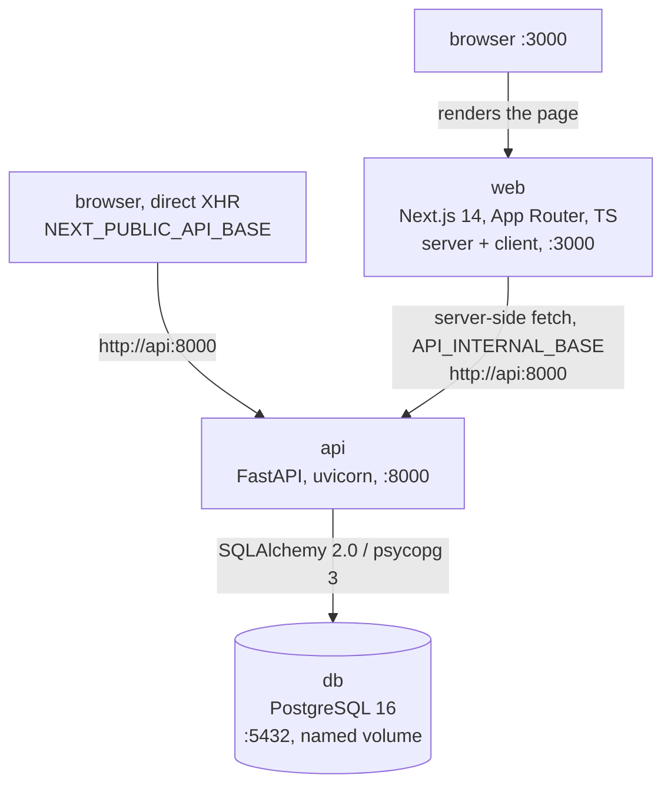

# Architecture

> Status: all four tiers built, plus a Phase 5 self-audit pass, Phase 6
> (role-based dashboards, registration, judging integrity), a later hardening
> pass with no feature tier of its own, and a final round: a scale pass
> ("Performance"), judge calibration, admin levels, event archival and
> role-checked sign-in tabs. This document is written as the system is built,
> not after.

## Project history

The phase-by-phase account, moved here from README.md so the pitch a judge
reads first stays short. Nothing below changes what "What works" and "What it
does not do yet" already claim -- it is where those claims came from.

T1 — auth, roles, events, teams, submissions with a deadline that holds, a
public gallery. T2 — judge assignment, a weighted organizer-configurable
rubric, backend-enforced role isolation, a live progress dashboard,
cross-judge normalization with a documented method, CSV export. T3 —
community voting in three access modes with quadratic voting as a full
option, comments with moderation, results hidden until published, randomised
ballot ordering, rate limiting, duplicate-vote detection, and an audit log an
organizer can actually read. T4 — a documented REST API with webhooks, signed
and publicly verifiable records, an embeddable gallery, and bulk import to
match the export.

**Phase 5** was a full self-audit rather than a feature tier: asymmetric
(Ed25519) certificate signing with real key rotation, a hash-chained
tamper-evident audit log, pairwise judging (Bradley-Terry, additive to the
scored rubric), and a pass that found and closed several gaps nobody had
flagged — voting configuration (quadratic voting, open-link/email-gated
access) had no write path at all before this pass, six of ten webhook topics
silently never fired, and a CSV-import path bypassed the stored-XSS
validation the JSON API already had.

**Phase 6** added per-event registration ahead of team formation, admin
disqualification for cause, judge conflict-of-interest recusals, best-effort
outbound email, and — the piece that touches every page — real role-based
dashboards: `/dashboard` fans out by actual server-verified role rather than
one page trying to be everything. The login page's role tabs are a check, not
a gate: pick one explicitly and the API, after verifying the password and
before creating any session, refuses an account of a different role and names
the right tab instead of signing anyone in.

**A later hardening pass**, with no new feature tier of its own, closed
several things a fresh look found: judges and organizers can no longer
self-register into those roles by any path — an admin provisions the account
directly, with a generated password emailed rather than typed; a participant
could look up *any* project's certificate codes with no proof of membership,
closed to a team-only lookup; judging and organizing certificates became
admin-issued rather than self-service; scoring moved from whole numbers to a
continuous 0.1-step scale; four list endpoints that returned an unbounded
array gained real pagination; and the admin dashboard gained an announcements
panel to match the one an organizer already had.

**A final round**, each covered in full where it lives rather than repeated
here: a scale pass (["Performance"](#performance) — 1,200 submissions, 520
judges, 54,600 votes, 110,000 chained audit entries, three real bottlenecks
found and fixed), judge calibration
([JUDGING.md §10](JUDGING.md#10-judge-calibration-optional-deliberately-small)),
three admin levels and event archival (["Admin levels"](#admin-levels) and
["Event archival"](#event-archival) above), and role-checked sign-in tabs
(["The sign-in role tab"](#the-sign-in-role-tab) above). See README.md's
["What it does not do yet"](README.md#what-it-does-not-do-yet) for the honest
remainder of all of it.

## The shape

Three processes, one Docker network, no hosted dependencies.



 -`web` never talks to `db`. Every read and write goes through `api`, which is
the only place authorization is decided.

## The one decision everything else hangs off

**All access control lives in a single server-side function.**

```python
def check_access(user, resource, action) -> bool
```

Every route that touches a non-public resource calls it before doing anything
else. Not a decorator scattered across handlers with per-route logic, not a
frontend `if (role === 'judge')`, not a filtered query that quietly returns
fewer rows. One function, one place to read, one place to audit.

Why this matters more than it looks:

- **T2 role isolation** ("a judge must never see another judge's scores") is a
  single predicate in that function, not a property you have to re-establish at
  fifteen call sites. Built in Phase 2, and it cost three branches: ownership of
  the ballot, the judge's track, and the judging window. The isolation tests were
  written before the feature, which is why it has that shape.
- **T3 hidden results during voting** is the same predicate with a time
  component. Reusing the function means the voting window cannot leak through a
  route somebody forgot about. Built in Phase 3 as `Action.READ_TALLY`, and it cost
  one branch: `_is_staff(user) or event.results_public(now)`.
- **The acceptance suite curls another judge's scores and expects 403.** If
  authorization were spread across the codebase, passing that test would tell
  you about one endpoint. Centralised, passing it tells you about all of them.

The frontend still hides buttons — that is a courtesy to the user, not a
control. Removing every check from the UI must not change what the API permits.

### Roles

An ordered enum. Higher roles are strictly more privileged, which lets most
checks reduce to a comparison:

```
visitor < participant < judge < organizer < admin
```

### Admin levels

`Role.ADMIN` is one rung on the ladder above, and it stays one: every
`at_least(ADMIN)` check in the codebase means what it always meant. What used to
be a single, all-powerful admin is refined by `users.admin_level`, which only
matters while `role = 'admin'`:

| Level | May do | May not |
|---|---|---|
| `owner` | everything an admin could always do | -- |
| `manager` | everything an owner can, incl. events and the global audit | administer accounts: create users, change roles or levels, deactivate |
| `auditor` | read everything an admin reads, incl. the audit log and its chain check | change anything, at all |

Existing admins became `owner` by column default, so nothing moved for them, and
a newly created or promoted admin is a `manager` unless the owner says otherwise
-- least privilege that can still write, rather than silently a second owner.
The last active owner cannot demote themselves, so the platform cannot be left
with nobody able to administer accounts.

Levels are held in the same two places the rest of authorization is, not
sprinkled across routes. Account administration is one predicate
(`_is_account_admin`) used by exactly the two branches that gate it
(`Action.CREATE_USER`, and role/deactivate on a `User`). Read-only is enforced
twice on purpose, because it is a negative property ("nothing can write") and
those are the ones a missed call site breaks: `check_access` refuses every verb
outside an explicit read list (so a verb added later is denied by default), and
`get_current_principal` refuses any non-`GET`/`HEAD`/`OPTIONS` request from an
auditor before a handler runs -- so a route that forgot to call `check_access`
is still closed. The one exception is `/api/auth/*`, so an auditor can still
sign out and change their own password. That is the single place
`get_current_principal` raises instead of returning a principal; its docstring
says so.

### The sign-in role tab

The sign-in page's tabs (Participant, Judge, Organizer, Admin) are a *check*, never a
source of a role. When a tab has been explicitly chosen it travels with the
credentials as `expected_role`; the API verifies the password first, and only then
compares. A mismatch is refused with a message naming the right tab -- and creates no
session and no cookie, and skips the password rehash, so a refusal leaves no trace on
the account. Doing the comparison *after* the password is what stops the tab being
used to probe which role an address holds (a wrong password gets the same 401 whatever
tab was chosen). With no explicit choice -- a plain `/login`, or a deep link carrying
only `?next=` -- nothing is enforced, because the default highlight is a starting point
and treating it as a selection would turn every judge or organizer following a link
into an error. `tests/test_auth_api.py` and `e2e/tests/login-tabs.spec.ts`.

### Event archival

An event can be **archived**: frozen, out of the way, and still a permanent record.
One nullable column, `events.archived_at`; `NULL` is an active event.

*Frozen* is enforced where everything else about authorization is: a gate in
`check_access`, above the per-resource branches and next to the auditor gate, that
finds the event a resource belongs to (`_event_of`: the event itself, and its
tracks, prizes, questions, criteria, judges, ballots, scores, teams, submissions,
voters, votes, comments and announcements) and refuses every verb not on the read
list. So there is no route-by-route list of what an archived event forbids to keep
in step with the routes: a route that calls `check_access` is frozen, and
`tests/test_event_archival.py` checks the whole verb list against every resource
type rather than a hand-picked handful. The one verb the gate lets through is
`ARCHIVE`, so an organizer can always unfreeze -- and it is its own verb rather than
`MANAGE` precisely because `MANAGE` is refused while archived.

Two consequences worth stating rather than discovering: **deleting an archived event
is refused** (unarchive first -- archiving is the non-destructive alternative, and
the extra step is deliberate), and **certificates cannot be issued or revoked on one**
(they are a write on the event). The public certificate download and verify pages
take no account and are unaffected.

*Out of the way* is a listing rule, not a hiding rule. `GET /api/events` leaves
archived events out by default, and `?archived=only|include` brings them back; the
event page, gallery, results and certificates keep working for anyone with the link,
because an archived event is the record of something that happened. Staff only, and
not a read-only admin (`ARCHIVE` is not on the auditor's read list). Archiving and
unarchiving are audited (`event_archived`, `event_unarchived`).

Ordering handles the coarse cases. The interesting ones — "a judge may read
*their own* scores but not a peer's", "a track judge sees only their track" —
are relationship checks inside `check_access`, not role comparisons. Role rank
is a floor, never the whole answer.

## Stack choices

| Choice                        | Why                                                                                                                                                                                                                                                                             |
| ----------------------------- | ------------------------------------------------------------------------------------------------------------------------------------------------------------------------------------------------------------------------------------------------------------------------------- |
| **FastAPI**             | Generates an OpenAPI spec from the route signatures for free. The brief notes that no platform in this category publishes an official API; getting one as a by-product of the framework rather than a side project makes "every UI action is an API action" cheap to keep true. |
| **PostgreSQL**          | Runs locally in a container. Real constraints — unique indexes for duplicate-vote detection, foreign keys, transactions — are load-bearing for judging integrity, not decoration.`ILIKE` covers gallery search without adding a search service.                             |
| **Next.js App Router**  | Server components let session-gated pages fetch through the API on the server, so the token never has to be readable from JavaScript.                                                                                                                                           |
| **Self-built sessions** | Auth-as-a-service is explicitly out of scope, and it is also the wrong shape here: sessions are opaque server-side rows, so revoking one is a`DELETE`, and the audit log can join against them.                                                                               |
| **SQLAlchemy 2.0 ORM**  | Typed models, and`Base.metadata` is what Alembic diffs against to generate a migration (Phase 5; see "Migrations" below).                                                                                                                                                     |

## Request lifecycle

As built. Every step is now real: the `audit_log` write landed in Phase 3 and
happens inside the transaction of the thing it records, so there is no state where
the change committed and the entry did not.

Authorization happens before the handler does work, so a denied request never
reads the data it was denied.

Three details that turned out to matter:

**"Not logged in" is a role, not an error.** `get_current_principal` never
raises; a request with no cookie resolves to `ANONYMOUS`, which carries
`role=visitor`. So the public gallery and an admin-only route go down the same
code path, and there is no "unauthenticated" branch for a check to be forgotten
in. Routes that genuinely need an account call `require_authenticated()`
explicitly.

**403 vs 404 is an information-leak decision.** `require_access` takes a
`status_code`. An unpublished event and another team's draft return **404**,
because a 403 would confirm the resource exists — answering a question the
caller was not allowed to ask. Everything else returns 403.

**Bearer tokens are supported alongside the cookie.** The same opaque session
token works in `Authorization: Bearer`, so every endpoint is reachable from
`curl` without a cookie jar. "Every UI action is an API action" is not true if
the API is only usable from a browser, and the acceptance suite is a `curl`
client.

Sessions are opaque rows: the cookie holds a 256-bit random token and the table
stores only its HMAC (keyed with `SESSION_SECRET`). Expired sessions are deleted
when next presented rather than swept on a timer, and `last_seen_at` is written
at 5-minute resolution rather than on every request.

## Judging, and the one place staff privilege stops

Phase 2 added four tables and one rule worth reading twice:

**Organizers may read every ballot and may not write one.**

Everywhere else in this codebase, organizer and admin are the roles that can do
anything to an event. `Action.SCORE` is the single exception. An organizer who can
author a judge's score can forge a result, and nothing downstream -- not the
export, not the normalization, not a future audit log -- could tell the forgery
from the judgement. So staff may delete an assignment, which is administration,
and may not author its scores, which is judging.

`PUT /api/judging/assignments/{id}/scores` has no "on behalf of" parameter at all.
Refusing a request is a check; not being able to express it is a property.

### The ballot is the unit of isolation

Not the submission, and not the user. Every score hangs off a `judge_assignments`
row, so three separate-sounding requirements collapse into one ownership check:

| Requirement                               | Where it lives                              |
| ----------------------------------------- | ------------------------------------------- |
| A judge must not see a peer's scores      | `assignment.judge.user_id == caller.id`   |
| A track judge must not see another track  | `judge.judges_track(submission.track_id)` |
| Scoring closes outside the judging window | `event.judging_open(now)`                 |

A `Score` has no rules of its own: it is readable and writable exactly when its
ballot is. One rule, not two to drift apart.

**403 here, not 404.** Unlike an unpublished event or another team's draft, that a
peer judge holds a ballot is not a secret -- the organizer's grid shows the whole
thing -- so there is nothing to protect by pretending the row does not exist. This
document is also the contract the acceptance suite reads: it curls another judge's
scores and expects 403.

### Maths lives outside the web layer

`app/scoring.py` and `app/assignment.py` are pure functions over dataclasses: no
ORM, no session, no HTTP. `serializers.scoring_criterion` is the one-line bridge.

That boundary is deliberate. The normalization is the part of this project most
likely to be argued with, so it is testable with numbers a reader can check by
hand rather than through fixtures and a test client -- and
`tests/test_assignment.py` can assert the assignment constraints over generated
populations in milliseconds. The defence of the method is in
[JUDGING.md](JUDGING.md).

Results are **computed on every request** rather than stored, and nothing goes
stale when a judge edits a ballot or an organizer changes a weight. The CSV
export and the results page call the same `gather()`, so the spreadsheet and
the dashboard cannot disagree.

**Measured, not assumed, at 5-10x the seeded fixtures**: a Phase 5 load pass
seeded 200 submissions, 50 judges, ~1,000 completed ballots and 1,500 votes
directly into a running instance and timed the real endpoints. `gather()` --
the query, its eager-loaded relationships, and `normalize()`'s own maths --
takes **~1-1.4s** for 1,000 ballots under isolated conditions (a query-by-query
trace found no N+1 and no missing index: every relationship is
`selectinload`-batched, and the slowest single query was ~240ms). The rubric
maths itself is the smallest piece of that, at ~130ms; the rest is Postgres and
SQLAlchemy doing real work over a genuinely large object graph. "A few hundred
rows and a millisecond" was true at the fixture's 6-16 submissions and is not a
claim this document makes anymore at hackathon-plus scale. A later pass went
another order of magnitude up -- 1,000+ submissions, 500+ judges, 50,000+
votes, 100,000+ audit events -- and is written up on its own, with what it
changed, in **"Performance"** below.

**What that finding did and does not mean.** Nothing fell over: the same pass
also hit `GET .../submissions` (200 rows, 336KB), `GET .../assignments` (1,000
rows, 1MB) and `GET /api/users` under load and every one returned the right
data, just as an unbounded array with no `limit`/`offset`. At the seeded
fixture's scale that is invisible; at 200+ submissions it was a
multi-hundred-KB-to-1MB response an organizer's browser had to parse on every
page load. Not fixed in that pass, deliberately, for the reason named at the
time: retrofitting pagination touches the response shape of every endpoint that
needs it and every frontend page that calls them, and doing that hastily risks
the exact kind of read/write drift this project's own self-audits keep finding
elsewhere.

**A later pass did retrofit it, for exactly that reason and not hastily.**
`app/pagination.py` is one `Page[T]`/`PageParams` implementation (offset/limit,
`DEFAULT_PER_PAGE = 50`, `MAX_PER_PAGE = 200`) shared by every list endpoint
large enough to need it, rather than each hand-rolling its own arithmetic that
could quietly drift from the others -- the same "one implementation, not one
per call site" reasoning `gather()` itself follows. Eight endpoints now return
`Page[...]` instead of a bare array: `/submissions`, `/assignments`, `/teams`,
`/users`, `/comments`, `/registrations`, the organizer's `/certificates` list,
and `/webhooks/{id}/deliveries`. `GalleryPage` (`schemas.py`) predates this and
was deliberately left alone -- it already worked, was already tested, and
converting it would have bought nothing functional, the same reasoning that
kept this pass from touching endpoints that did not need it. Every
corresponding frontend page (`/admin`, the organizer submissions/assignments/
teams/registrations views, comment threads, the certificate list) was updated
to pass `page`/`per_page` and render the same `Pagination` component, so a
reader who has learned to page one list has learned to page all of them.

## Judge calibration: beside the results, never in them

Before real judging, an organizer can add one or two **practice projects** with the
score they expect for every criterion; each judge scores them like a real ballot,
and a report says who ran harsh or generous. The maths is a pure module
(`app/calibration.py`, in the same style as `scoring.py`): each criterion's deviation
is `(judge - expected) / (max - min)`, so a 1-5 and a 0-10 criterion count equally;
a judge is flagged at or beyond +/-0.10 of the range in mean signed deviation, and a
mean *absolute* deviation is reported beside it because a judge far too high on one
project and far too low on another averages to zero. No verdict is issued until every
practice project is fully scored.

Two structural decisions matter more than the arithmetic. A practice project is **not
a `Submission`**: it has its own three tables, no team, no gallery presence and no
ballot, so calibration scores physically cannot reach `gather()` or a result. And the
judge-facing response type has **no field that could carry an expected score**, so
"a judge never sees the answer" is a property of the type rather than of a query
that happens to filter correctly. What it does not do is stated in JUDGING.md §10:
it is a noisy flag for a conversation with one or two samples, not a correction and
not evidence of collusion.

## Pairwise judging: additive, not exclusive

Phase 5 adds the Gavel approach as a second judging mechanism, not a replacement
for the rubric above: `Event.pairwise_enabled` is its own boolean, both share the
judging window, and an organizer may run both on the same event. That decision
was made once, deliberately, rather than falling out of the schema by default --
the tempting alternative was a single `judging_mode` enum forcing a choice
between "scored" and "pairwise", which would have meant migrating every existing
event's data the day a "pairwise for round one, rubric for finalists" workflow
came up. A boolean nobody is forced to flip cannot cause that migration.

There is deliberately **no `PairwiseAssignment` table** mirroring
`JudgeAssignment`. A scored ballot is a specific piece of work handed to a
specific judge and needs a row to track whether it is done; a pairwise
comparison has no such thing to track -- `app/pairwise.pick_next_pair()`
computes which two projects to show next from the comparisons already on file,
and a row is only ever written after a judge actually answers. Persisting a
"pending comparison" would be state with no reader: nothing needs to know a pair
was *shown*, only what was *answered*.

The ranking itself is fit fresh on every read of `GET .../pairwise/results`, the
same "computed, not stored" choice `results.py` makes for the scored ranking and
for the same reason -- a few dozen comparisons at hackathon scale is a
millisecond of MM iteration, and there is nothing to go stale when a new
comparison lands.

The maths, the two edge cases a naive Bradley-Terry implementation gets wrong
(ties, disconnected components), and the worked proof are all in
[JUDGING.md §6](JUDGING.md) and `app/pairwise.py`'s own module docstring.

## Public voting, and what a vote is worth

Phase 3 added five tables and one idea that shapes the rest: **a ballot is an
identity, and the identity is only as good as the mode that issued it.**

`voters` is that identity, scoped to one event. Three modes, and the difference
between them is *how the row is identified*, never how the votes are counted:

| Mode              | Identified by     | A second ballot costs                                    |
| ----------------- | ----------------- | -------------------------------------------------------- |
| `authenticated` | the account       | a second account                                         |
| `email_gated`   | a claimed address | a second address —**and nothing verifies either** |
| `open_link`     | an opaque token   | clearing cookies                                         |

The counting code does not branch on the mode at all. That is deliberate: the
weakness lives in one place, it is the organizer's explicit choice, and the tally
**labels itself** with what its numbers can be read as. An open-link total is a
popularity signal, not a count of people, and the API says so in a `caveat` field
rather than leaving a reader to assume.

### Quadratic voting

`n` votes on one project cost `n²` credits from a fixed budget. Influence is linear
in votes, price is quadratic in them, so the marginal cost of the nth vote is
`2n−1` — intensity is expressible and never cheap, which is the most credible
answer anyone has shipped to a loud minority deciding the outcome.

Two consequences worth naming:

- **The ballot is validated as a unit.** The budget is global, so three individually
  modest choices can be collectively unaffordable. A per-project endpoint would let
  them through, which is why `PUT /votes` replaces the whole ballot rather than
  incrementing one project.
- **Over budget is refused whole, never trimmed.** Quietly reducing somebody's vote
  to make it fit would be a worse answer than telling them the number — and the
  error names it: *"that ballot costs 121 credits and you have 100"*.

The maths is in `app/voting.py`, pure and without a database, for the same reason
`app/scoring.py` is.

### Randomised ballot ordering

Position bias is real: whatever sits at the top of a long list gets votes it did not
earn. So every voter gets their own permutation, from a seed stored on their
`voters` row.

Stored rather than derived from the session, because the order has to be random
**between** voters and stable **for** each one — reshuffling on every page load
would move a project somebody was halfway through considering. Implemented as a
sort on `sha256(seed:id)` rather than `random.shuffle`: no global RNG state, no
dependence on Python's shuffle staying stable across versions, same answer on any
machine.

## The audit log, and why it is prose

The requirement is about the reader: *an audit trail an organizer can read without a
database client*. That one sentence decided the design.

Every entry carries a **complete English sentence**, written at the moment of the
action while the context to write it still exists. The structured columns are there
so the log can be filtered; the sentence is there so it can be read. A log that says
`UPDATE scores SET value=4 WHERE id='3bc0…'` is a changelog for a database, and an
organizer mid-incident needs a sentence.

Three properties hold:

1. **Append-only**, by API surface. There is no update or delete route for
   `audit_log` anywhere, and `app/audit.py` offers no function that would write one.
2. **Written in the caller's transaction.** `record()` adds to the session and does
   not commit; the route commits both together.
3. **The actor survives their own deletion.** `actor_id` is `SET NULL`, and
   `actor_label` keeps the text.
4. **Hash-chained (Phase 5).** Every row stores `prev_hash`/`entry_hash` over a
   strictly-ordered `seq`, so an edit that stops short of recomputing every hash
   after it is detectable — `GET /api/audit/verify` walks the chain and reports the
   first break. See `app/audit.py` and THREAT-MODEL.md §10 item 7.

The event this row belongs to can be deleted after the fact (an organizer deleting a
test event, say), and the entry must survive that — a log where the deletion record
itself vanished with the thing it describes would defeat the point. `event_id` is
therefore `SET NULL` rather than `CASCADE`, and `event_slug` is denormalised onto the
row at write time so it still reads sensibly with no event to join to.
`GET /api/audit` (admin-only, cross-event) can filter to `orphaned=true` to surface
exactly these rows.

## Rate limiting: the open question, closed

ARCHITECTURE.md carried this as an open question for two phases. **Postgres wins**,
and the deciding argument is what is being limited: an in-process counter resets
when the container restarts, so an attacker who can make the app restart — or who
just waits for a deploy — resets it for us. A counter that survives is worth more
than a counter that is fast.

Fixed window, one atomic upsert per request. The cost is the standard boundary
burst, which does not matter for stopping scripted ballot minting. Keys are built
from the client address, which is both spoofable and shared by everyone behind a
NAT — so the limits are generous on purpose: a limiter that blocks a real voter is
worse than none, because the organizer switches it off.

## Outbound: the trust boundary that points the other way

Every control described so far protects the API from its callers. T4 adds one that
points outward, and it is a different shape of problem.

A webhook is **the API making a request to an address an organizer chose**, from
inside the Docker network. Unguarded, that is server-side request forgery with a
friendly label: one hop to Postgres, and on a cloud host one hop to the instance
metadata service.

So `app/hooks.check_target` is deny-by-default and runs **twice** — at registration,
so an organizer learns immediately rather than discovering months later that nothing
was delivered; and again at delivery, because DNS can be re-pointed afterwards.

The rule that took two attempts is worth recording. Checking only whether a host
*resolves* to a private address leaves a gap: `db` does not resolve on the laptop where
the hook is registered, but resolves to a container where the server later calls it.
The guard passed at registration and the attack landed at delivery. **A hostname with
no dot cannot be a public FQDN**, so single-label names are now refused on shape — a
decision that does not depend on DNS answering, or answering the same way twice.

Delivery itself runs in a `BackgroundTasks` callback with its own session, for two
reasons: the triggering action must not wait on somebody's broken relay, and the
request's session is closed by the time the task runs. A hook can never be the reason
a ballot was not saved.

## Signing: bytes, not objects, and asymmetric on purpose

`app/signing.py` exists to avoid a short list of specific mistakes. A record is only
publicly verifiable if a third party can check it **without trusting the page that
displays it, and without trusting our verdict**, which means:

* **Sign bytes and store them.** Re-serialising a payload at verification time makes
  the signature depend on key order, float formatting, and every future change to the
  response model. The canonical encoding is produced once and kept.
* **Ed25519, not HMAC.** An HMAC's verification step needs the same secret that
  produced the signature, so "verified" really means "the server holding the secret
  says so" — a stranger checking a record has no way to confirm that themselves, only
  to trust us. Ed25519 is asymmetric: the private half signs, the public half
  verifies, and the public half is published at `GET /api/signing/public-keys`. A
  verifier needs nothing else from us.
* **Constant-time verification for free.** `cryptography`'s Ed25519 `verify()` does
  not leak timing information the way a hand-rolled `==` comparison would; there is
  no `compare_digest` to remember here because there is no shared secret to compare
  against in the first place.

Every signed record stores a `key_id` alongside its signature, naming which key to
verify it against. That indirection is what makes rotation possible: `SIGNING_ACTIVE_KID`

+ `SIGNING_ACTIVE_PRIVATE_KEY_PEM` name the key that signs *new* records, and
  `SIGNING_RETIRED_KEYS` holds the **public** half of every key that used to be active.
  Rotating in a new key does not invalidate a single certificate already issued —
  `verify()` looks up `key_id` in the combined active+retired set, never assumes there
  is only one key. That is the property a shared-secret HMAC has no answer for: rotating
  it invalidates every signature made under the old one, because the old secret does not
  survive rotation on purpose. Ed25519 keeps the private key of a retired `kid` gone
  while its public key lives on for exactly as long as records signed under it exist.

This closes the gap [THREAT-MODEL.md §7](THREAT-MODEL.md) used to call out.

## The embed is an iframe, deliberately

Most embed widgets ship a script that injects markup into the host page. That means
our code runs in *their* origin with access to their DOM and cookies — so a compromise
here becomes a compromise of every site that embedded us.

The widget is an **iframe** instead. It renders in its own origin, the browser
sandboxes it, our CSS cannot leak out and theirs cannot leak in. The one-line `.js`
snippet writes the `<iframe>` tag and nothing else; it is a convenience, not the
mechanism.

The frame sets `frame-ancestors *` and no `X-Frame-Options`, which looks like a
missing header and is a decision: being framed *is* the feature. It is safe because
the page is public, read-only, reads no cookie and accepts no input — and it serves
exactly what `GET /api/gallery` already serves anonymously, through the same
`PUBLIC_SUBMISSION_CRITERIA` tuple, so there is no second definition of "public" to
drift.

## Startup sequence

`docker compose up` is required to be sufficient, so the API container owns its
own readiness rather than assuming the database is up:

1. Compose gates `api` on the Postgres healthcheck (`pg_isready`).
2. `entrypoint.sh` runs `wait_for_db` anyway — a cold laptop's first `initdb`
   can outlast the healthcheck retries.
3. `alembic upgrade head` brings the schema to the latest migration.
4. `seed` populates fixtures, idempotently, so restarts do not duplicate data.
5. uvicorn starts.

Steps 3 and 4 being idempotent is what makes `docker compose up` safe to run
repeatedly, which is what makes it a credible single command. Step 3 is
idempotent because that is what a migration tool *is*: `alembic upgrade head` on
a database already at head is a no-op, the same property `create_all` had for a
schema that never changed shape underneath it -- see "Migrations", below, for why
`create_all` stopped being enough.

## Migrations

Through Phase 4, `schema_init.py` ran `Base.metadata.create_all()` on every
start. Honest for a schema that only ever grows new tables, and quietly wrong the
moment an existing column's shape changes: `create_all` creates what is missing
and alters nothing, so a deployment with data in it would silently keep the old
column forever. This stopped being a hypothetical during Phase 5's own work --
`Certificate.signature` needed to widen from 64 to 128 characters for Ed25519,
and `AuditEntry` needed three genuinely new NOT NULL columns
(`seq`, `prev_hash`, `entry_hash`) added to a table that already had rows in the
running dev database. Both are exactly what `create_all` cannot do, and hitting
that live (a real `ProgrammingError: column does not exist`, and separately a
real `NotNullViolation` from `seed.py`'s own fixture data written before the
column existed) is what made "documented gap" no longer good enough.

Alembic replaces it. `alembic/env.py` points at `app.db.Base.metadata` and at
`DATABASE_URL` via `app.config.settings` (one source of truth for the URL, not
two files that can drift), and `alembic/versions/dae9c25aa5fa_baseline.py` is every table
this project has as of the end of Phase 5, generated by
`alembic revision --autogenerate` against an empty database and checked against
`Base.metadata` with `alembic check` until the two agreed exactly. A schema
change from here on is `alembic revision --autogenerate -m "..."`, a read of what
it proposed, and a commit -- never a second hand-edit of `schema_init.py`,
because there is no more `schema_init.py`.

The test suite is the one place `create_all` still runs directly, and that is
safe rather than an inconsistency: `alembic check` proved the migration and the
ORM metadata build an identical schema, so a database either one creates is the
database the tests are written against.

**One real gap in that safety net, found in Phase 6 and worth naming plainly**:
`alembic check`/`--autogenerate` reliably diff new tables, columns and
constraints, but do **not** reliably detect a new *value* added to an existing
Python enum backed by a native Postgres `ENUM` type (`_pg_enum()` in
`models.py`). Three `AuditAction` members
(`third_review_assigned`, `judge_recused`, `event_registered`) were added
across two migrations with no accompanying `ALTER TYPE ... ADD VALUE`, and
`alembic check` reported nothing wrong -- because the test suite's own
`create_all()` always builds the Postgres enum type fresh from *whatever the
Python enum currently says*, this went completely unnoticed by the test suite
for as long as the gap existed, and would only have surfaced against a real
migrated database the first time one of those three actions actually fired
(`psycopg.errors.InvalidTextRepresentation: invalid input value for enum audit_action`). Closed by a hand-written migration
(`4bef2bf4c0a8_backfill_missing_audit_action_enum_values`) once found. The
takeaway, not yet automated: adding a member to `AuditAction`, `Role`, or any
other `_pg_enum()`-backed Python enum needs its own explicit `ALTER TYPE ... ADD VALUE IF NOT EXISTS` migration, written by hand -- `--autogenerate` will
not produce one, and will not warn that it didn't.

Two follow-on gotchas found closing the same gap for `SubmissionStatus. DISQUALIFIED` (`74f44fef0002` / `c1a9f7b3e4d2`), worth naming alongside it:

- `--autogenerate` also does not detect a change to an existing
  `CheckConstraint`'s condition text (only whether a constraint by that name
  exists at all), so a tightened or loosened CHECK needs the same
  hand-written drop-and-recreate treatment as an enum value.
- If the new CHECK's condition references the newly added enum value, the
  `ALTER TYPE ... ADD VALUE` and the constraint change cannot be in the same
  migration -- Postgres refuses to use a new enum value before the
  transaction that added it commits. Splitting them into two migration files
  is necessary but was not, on its own, sufficient: `env.py` originally ran
  every pending script inside one transaction for the whole `upgrade head`
  invocation, so a from-scratch deploy (behind by both revisions at once,
  applying them in a single `alembic upgrade head` call) hit the exact same
  error the unsplit version did. Fixed at the root by adding
  `transaction_per_migration=True` to `context.configure` in `env.py`, so
  each script now commits independently -- the general, permanent fix for
  this whole class of "add a value, then use it" migration pair, not just a
  workaround for this one.

## Performance

**A second order of magnitude up from the Phase 5 pass** ("Maths lives
outside the web layer", above): 1,200 submissions, 520 judges, 3,600 complete
ballots (3 reviews/submission), 54,600 votes, 110,000 chained audit entries,
seeded directly into a running `docker compose up` stack -- `DOGFOOD_DB_PORT`
and all, the same laptop-with-a-host-Postgres workaround anyone reproducing
this needs -- rather than assumed. Unlike the Phase 5 pass, the tool is
checked in this time: `scripts/load_test/seed_scale.py` writes through the
same ORM models `app/` uses (so the rows are exactly as real as anything the
API would have produced, audit hash chain included -- see the script's own
docstring for how a 100,000-row chain gets seeded without either replaying
`app.audit.record()` once per row or breaking the chain the very next real
write makes), and `scripts/load_test/measure.py` drives the running API and
reports p50/p95/p99 plus `docker stats` for the `api`/`db` containers. Both
are meant to be re-run, not just read.

Two different questions need two different measurement shapes. **Heavy,
staff-only, one-at-a-time endpoints** -- `/results`, `/results/disagreement`,
`/results/consistency`, `/audit/verify`, the results CSV export -- are each
computing something over every ballot, vote or audit row in the event; an
organizer hits these occasionally, never in a crowd, so they are timed
sequentially, repeated, for "how long does one organizer actually wait":

| Endpoint | p50 | p95 | p99 |
|---|---|---|---|
| `GET /results` (`gather()`, full computed table) | 1.7s | 1.9s | 1.9s |
| `GET /results/disagreement` | 1.6s | 1.7s | 1.7s |
| `GET /results/consistency` | 1.7s | 1.8s | 1.8s |
| `GET /audit/verify` (global, whole chain, 110,043 rows) | 7.5s | 7.9s | 8.0s |
| `GET /export/results.csv` | 3.1s | 4.1s | 4.3s |

**Paginated, frequently-hit endpoints** -- the submissions/assignments/audit
lists, the vote tally, the public gallery -- *are* hit concurrently in
practice (many judges, many visitors), so these are measured at 25-30
simultaneous workers hammering one endpoint for 10-12 seconds each:

| Endpoint | p50 | p95 | p99 |
|---|---|---|---|
| `GET /submissions` (paginated, 50/page) | 2.7s | 3.9s | 4.0s |
| `GET /assignments` (paginated, 50/page) | 3.3s | 4.6s | 4.8s |
| `GET /{slug}/audit` (per-event, paginated) | 1.3s | 1.7s | 2.4s |
| `GET /voting/results` (tally, `GROUP BY`) | 3.9-7.1s | 4.8-10.1s | 5.1-10.5s |
| `GET /gallery` (public, filtered) | 1.0s | 2.9-4.8s | 4.6-6.2s |

During the concurrent phase, `api` (a single, `--reload`-mode uvicorn
process -- see `entrypoint.sh`) averaged **~125% CPU** (i.e. just over one
core, consistent with Python's GIL serialising the CPU-bound parts of many
"concurrent" requests) and under 350MB RSS; `db` averaged **~50-85% CPU**,
peaking over 200% under the heaviest mix, and under 300MB RSS. Neither
container came close to its memory ceiling; CPU, not memory, is the resource
this scale of traffic actually spends on a laptop. The ranges shown for the
tally and gallery endpoints are real, not a formatting error: this is a
single Docker Desktop VM on a development laptop, not an isolated benchmarking
rig, and back-to-back runs of the same fixed code varied by roughly 2x
depending on what else the host was doing -- reported honestly rather than
rounded down to whichever run looked best. One run that stacked all five
concurrent-phase endpoints back-to-back at 30 workers each also produced a
single transient "connection reset" on the very last endpoint tested, with
zero application errors anywhere in either the request logs or the six other
runs -- read as evidence of *where* the practical ceiling of one laptop
container sits under sustained multi-endpoint hammering, not as a bug to chase.

**Three genuine bottlenecks came out of this pass. All three were fixed, the
first and third only as far as their remaining cost is avoidable:**

1. **`verify_chain()` hydrated every audit row into a full ORM `AuditEntry`**
   -- identity-map bookkeeping and relationship-lazy-loader setup included --
   to read twelve plain fields off each one. At 110,000+ rows that hydration
   was roughly 5 of the endpoint's ~13 seconds, on top of the SHA-256 +
   canonical-JSON work the hash chain actually needs. Fixed in `app/audit.py`:
   `verify_chain()` now selects exactly the columns `_hash_fields()` reads,
   as plain `Row`s, with `yield_per` so the table streams instead of loading
   entirely into a Python list before the loop starts. **~13s -> ~8s** at
   110,043 rows, same verification, same tests
   (`tests/test_audit_chain.py`), zero change to what gets checked or how a
   tamper is reported. The remaining ~8s is not hydration anymore -- it is
   110,000 SHA-256 calls over a canonical JSON encoding, which is what a hash
   chain actually costs to verify and cannot get cheaper without checking
   less. Parallelising that (each row's hash only depends on its own stored
   fields, so it genuinely could be split across cores) was considered and
   set aside: a process pool inside a single admin-only, once-in-a-while
   request handler is real complexity for an endpoint nobody is waiting on a
   spinner for at this project's actual scale, which is exactly the kind of
   trade this document elsewhere calls out by name rather than making
   quietly.

2. **The database connection pool, not any one query, was the actual ceiling
   on concurrent throughput.** `app/db.py`'s `create_engine()` carried no
   explicit `pool_size`/`max_overflow`, so SQLAlchemy's defaults applied: 5 +
   10 = 15 connections, total, for the whole process. Every sync route already
   runs on Starlette's own worker-thread pool (default 40 threads), so a
   request past the 15th was never CPU-starved -- it was queued waiting for a
   database connection 14 other requests already held. That is a textbook
   multi-second-tail-latency-with-zero-errors signature, and it is invisible
   at anything below real concurrency, which is exactly why the 200/50/1,500
   pass never saw it. Fixed: `pool_size=20, max_overflow=20` (40 total),
   matching the thread-pool ceiling rather than exceeding it -- Postgres's own
   `max_connections` defaults to 100, so there is headroom left for `alembic`,
   the seed script, and a human with a database client. In the run straight
   after this change the public gallery's p99 under 30-way concurrency fell
   from 4.8s to 1.2s; a later run on the same code drifted back to 6.2s (see
   the variance note above), so read that as "the tail got shorter", not as a
   precise multiple.

3. **`GET /voting/results` (the tally) did the `_votable()` submission query
   -- full `Submission`/`Team`/`Track` ORM hydration with two
   `selectinload`s, over every submitted project -- on every single call,
   even though its result is only ever *narrowed* when
   `event.community_vote_slots > 0`. For every event that predates the
   winner/community-vote split, and any event that simply doesn't use it (the
   common case), `_votable()`'s own early return is already exactly
   `event_id == event.id AND status == SUBMITTED` -- the same two conditions
   the aggregate query already carries -- so the `Submission.id.in_
   (votable_ids)` filter built from it narrowed nothing, and the ORM
   hydration that built the set was pure overhead paid on every poll. Fixed
   in `app/routers/voting.py`: that path now fetches only the one thing still
   needed (a submission -> track-name lookup) as two plain columns, and skips
   the redundant `.in_()` filter entirely, only when `community_vote_slots
   <= 0`; the split-in-use path is untouched. Cut concurrent p50 from
   ~11-13s to ~4-7s (see the range above) -- a real win, not a full fix: what
   is left is a live `GROUP BY` over the event's votes plus building and
   JSON-serialising up to 1,200 result rows on every poll, which is genuine
   work an uncached, always-current tally has to do. Caching it, or paginating
   the response, would cut further, at the cost of the "never stale" property
   `results.py`'s own "computed on every request" already claims elsewhere in
   this document -- a bigger, more deliberate change than this pass's remit,
   named here rather than made quietly.

All three fixes are covered by the existing test suite (the full backend
suite -- 814 passed, 1 skipped -- and the 9-test browser E2E suite pass with
all of them applied) and change no response shape or public behaviour; every
diff is a query strategy, not a contract. Note that the tally's before/after
figures were taken at 30 and 25 workers respectively and on a noisy laptop, so
treat "roughly half" as the honest resolution of that comparison.

## Deliberate non-goals

- **No search service.** Postgres `ILIKE` is enough at hackathon scale and adds
  no operational surface.
- **No object storage.** Images are URLs. Running a MinIO container to hold
  thumbnails buys nothing for adoptability.

## Open questions

Tracked here as they come up, resolved as tiers land.

- ~~Rate-limiter state.~~ **Decided in Phase 3: Postgres-backed.** See above.
- ~~Per-track normalization.~~ **Decided in Phase 5: yes, scoped per submission's
  track.** `normalize_by_track()` answers the "ranked separately" question by
  keeping one combined ranked list -- each project's rank reflects what it earned
  within its own track's comparison basis, rather than splitting the results page
  into per-track tabs. See JUDGING.md §3.
- ~~Where the audit log writes from.~~ **Decided in Phase 3: in the route**, inside
  the transaction of the change. A SQLAlchemy event hook would catch writes the
  routes forgot, but it loses the request context that makes an entry readable — and
  a log of unreadable entries fails the requirement rather than half-meeting it. The
  cost is that a new route must remember to call `record()`; the mitigation is that
  `tests/test_audit_log.py` asserts coverage per action.
- **Whether votes should be secret from organizers.** They are not today: an
  organizer can read the per-ballot export. A genuinely secret ballot would need the
  voter identity separated from the vote at write time, which also makes "one vote
  per person" unenforceable without blind signatures. Named in THREAT-MODEL.md §4
  rather than decided.
- ~~Symmetric or asymmetric record signing.~~ **Decided in Phase 5: asymmetric
  (Ed25519).** See "Signing: bytes, not objects, and asymmetric on purpose" above.
- **Webhook retries.** There are none — five consecutive failures disable a hook.
  Retrying needs a scheduler, and adding one to a stack whose selling point is
  `docker compose up` is a real cost. An organizer's fix is the Test button.
