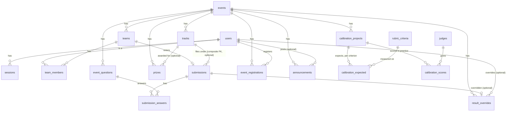
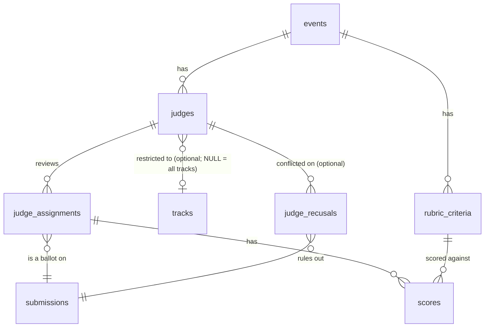
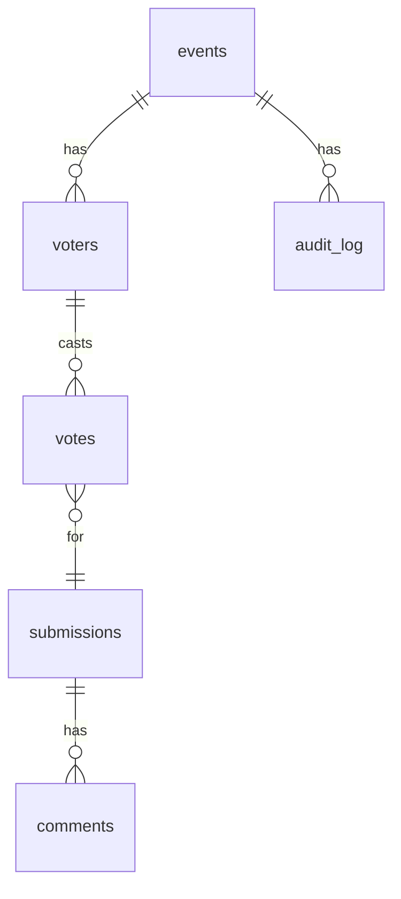
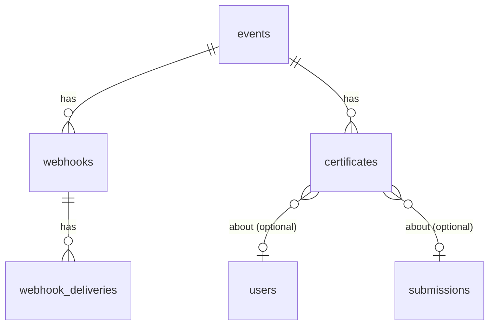

# Data Model

> Status: the schema is complete for every tier this project claims, through
> Phase 5's self-audit, Phase 6's tables, and a later pass's column-level
> changes (`scores.value`, certificates). This document is written as the
> system is built, not after.

## Principles

1. **Foreign keys are declared and enforced.** An orphaned score is a judging
   integrity bug, not a tidiness issue.
2. **Uniqueness constraints do the anti-abuse work.** Duplicate vote detection
   is a unique index, not application logic that races with itself.
3. **Timestamps are `timestamptz`, always UTC.** Deadline enforcement compares
   against the server clock; a naive timestamp is a deadline-gaming vector.
4. **Every major entity has a CSV in and a CSV out**, with the same column set,
   so an organizer can leave as easily as they arrived.

A fifth principle earned its place while Phase 1 was being built, and it is the
one a database person should read first:

5. **Cross-entity consistency is a constraint, not a convention.** A submission
   cannot point at a team from another event, and a user cannot be on two teams
   in one event, because composite foreign keys and unique indexes say so — not
   because every handler remembers to check. See
   [Composite keys](#composite-keys-the-load-bearing-trick) below.

## Status of the target tables

| Table | Lands in | Built? | Holds |
| --- | --- | --- | --- |
| `users` | Phase 1 | ✅ | Identity, password hash, global role |
| `sessions` | Phase 1 | ✅ | Opaque server-side session tokens |
| `events` | Phase 1 | ✅ | Event, its dates and windows |
| `tracks` | Phase 1 | ✅ | Judging tracks, as rows with identity |
| `prizes` | Phase 1 | ✅ | Prizes, optionally per-track |
| `event_questions` | Phase 1 | ✅ | Organizer-defined submission questions |
| `teams` | Phase 1 | ✅ | Team per event, rotatable invite token |
| `team_members` | Phase 1 | ✅ | User↔team membership |
| `submissions` | Phase 1 | ✅ | Project entries, draft/submitted state |
| `submission_answers` | Phase 1 | ✅ | Answers to custom questions |
| `judges` | Phase 2 | ✅ | Judge record scoped to an event (+ track) |
| `judge_assignments` | Phase 2 | ✅ | Which judge reviews which submission |
| `rubric_criteria` | Phase 2 | ✅ | Organizer-configurable criteria and weights |
| `scores` | Phase 2 | ✅ | One score per (assignment, criterion) |
| `votes` | Phase 3 | ✅ | Community votes, incl. quadratic budget |
| `comments` | Phase 3 | ✅ | Public comments on gallery projects |
| `audit_log` | Phase 3 | ✅ | Human-readable trail of sensitive actions |
| `voters` | Phase 3 | ✅ | A ballot identity, scoped to one event |
| `rate_limits` | Phase 3 | ✅ | Fixed-window counters, database-backed |
| `certificates` | Phase 4 | ✅ | Generated participation/judging records |
| `webhooks` | Phase 4 | ✅ | Organizer-registered outbound event hooks |
| `webhook_deliveries` | Phase 4 | ✅ | One attempt per hook per topic, with the outcome |
| `pairwise_comparisons` | Phase 5 | ✅ | One judge's "which is better" answer |
| `judge_recusals` | Phase 5 | ✅ | A judge, ruled out of one specific submission |
| `event_registrations` | Phase 6 | ✅ | A participant's sign-up, ahead of forming a team |
| `announcements` | Phase 6 | ✅ | Organizer notices, shown on the event page |
| `result_overrides` | Phase 6 | ✅ | Admin correction to a submission's final tier, for cause |
| `calibration_projects` | Phase 7 | ✅ | A practice project judges score before real judging |
| `calibration_expected` | Phase 7 | ✅ | The organizer's expected score, per criterion, per practice project |
| `calibration_scores` | Phase 7 | ✅ | One judge's score for one criterion of one practice project |

`tracks`, `prizes`, `event_questions` and `submission_answers` were folded out of
the original single-row `events` sketch. Each is a row rather than a column
because Phase 2 needs a track to have an identity that survives a rename, and
because an organizer's custom questions are data, not a schema change.

The schema source of truth is `backend/app/models.py`; Alembic (Phase 5) diffs
`Base.metadata` against the database to generate a migration, and
`alembic upgrade head` applies it. This document is written from that file --
`backend/alembic/versions/` is the schema as actually, historically applied,
which is the more precise record once there is more than one migration.

---

## Phase 1 columns

Types are the Postgres types actually created. `id` is `uuid` everywhere,
generated in Python rather than by the server so that seed fixtures and invite
links can be built before the row is flushed.

### `users`

| Column | Type | Notes |
| --- | --- | --- |
| `id` | `uuid` PK | |
| `email` | `varchar(320)` **unique** | Stored lower-cased |
| `display_name` | `varchar(120)` | |
| `password_hash` | `varchar(255)` | Argon2id (RFC 9106 low-memory profile), salt in the hash string |
| `role` | `user_role` enum | `visitor`/`participant`/`judge`/`organizer`/`admin`, default `participant` |
| `admin_level` | `admin_level` enum | `owner`/`manager`/`auditor`, `NOT NULL`, server default `owner`. Only meaningful while `role = 'admin'`; the API reports `null` for everyone else. See ARCHITECTURE.md "Admin levels" |
| `is_active` | `boolean` | A deactivated account is no account, not a lesser one |
| `created_at`, `updated_at` | `timestamptz` | |

- `ck_users_email_lowercase`: `email = lower(email)`. The unique index is the
  whole duplicate-account defence, so it must not be defeatable with a capital
  letter. Enforcing the case in the database rather than only in the handler
  means a future importer cannot reopen the hole.
- `ix_users_role` — the organizer dashboard lists by role.

### `sessions`

| Column | Type | Notes |
| --- | --- | --- |
| `id` | `uuid` PK | |
| `user_id` | `uuid` → `users.id` `ON DELETE CASCADE` | |
| `token_hash` | `varchar(64)` **unique** | HMAC-SHA256 of the cookie token |
| `created_at`, `expires_at`, `last_seen_at` | `timestamptz` | |
| `user_agent` | `varchar(400)` nullable | So a user can recognise a session to revoke |
| `ip_address` | `varchar(45)` nullable | 45 = max INET6 text length |

The cookie carries a random 43-character token; **the table stores only its
HMAC**. A stolen database dump does not yield usable session cookies, logging out
is a `DELETE`, and rotating `SESSION_SECRET` invalidates every live session at
once because no stored digest can be reproduced.

### `events`

| Column | Type | Notes |
| --- | --- | --- |
| `id` | `uuid` PK | |
| `slug` | `varchar(80)` **unique** | The public URL component |
| `archived_at` | `timestamptz` nullable | `NULL` is an active event. A timestamp freezes it: every non-read verb on the event or anything it owns is refused by `check_access` until it is unarchived. Nothing is deleted. See ARCHITECTURE.md "Event archival" |
| `name` | `varchar(200)` | |
| `tagline` | `varchar(300)` nullable | |
| `description` | `text` nullable | |
| `website_url` | `varchar(2048)` nullable | |
| `starts_at`, `ends_at` | `timestamptz` | |
| `registration_opens_at` | `timestamptz` | |
| `submission_opens_at`, `submission_deadline` | `timestamptz` | |
| `judging_opens_at`, `judging_closes_at` | `timestamptz` nullable | Configured in Phase 1, enforced in Phase 2 |
| `max_team_size` | `integer` | Default 4 |
| `is_published` | `boolean` | Unpublished events are invisible to non-staff |
| `created_by_id` | `uuid` → `users.id` `ON DELETE SET NULL` | Deleting a person must not delete their event |

Three windows, not one: `ck_events_dates_ordered` (`ends_at >= starts_at`),
`ck_events_submission_window` (`submission_deadline >= submission_opens_at`),
`ck_events_team_size_positive`. Registration, submission and judging do not open
and close together, and an organizer forced to fake one with another will fake
it badly.

The windows are methods on the model — `registration_open()`,
`submissions_open()`, `deadline_passed()` — all taking an injectable `now`, which
is what lets deadline behaviour be tested without waiting for a deadline.

### `tracks`

`id`, `event_id` → `events.id` `CASCADE`, `key varchar(60)`, `name varchar(140)`,
`description text`, `position integer`.

- `uq_tracks_event_key` — a track key is unique within its event, not globally.
- `uq_tracks_id_event` on `(id, event_id)` — redundant as a key, load-bearing as
  a **target**. See below.

### `prizes`

`id`, `event_id` → `events.id` `CASCADE`, `title varchar(160)`,
`description text`, `value varchar(80)`, `track_id uuid` nullable,
`position integer`.

`value` is free text, not numeric: `"$800"`, `"500 EUR"` and
`"Mentorship + credits"` are all things organizers actually award, and a
`numeric` column would force the third into a comment field.

`fk_prizes_track_same_event` on `(track_id, event_id)` → `(tracks.id,
tracks.event_id)` `ON DELETE SET NULL`: a track-specific prize must name a track
**of its own event**.

### `event_questions`

`id`, `event_id` → `events.id` `CASCADE`, `prompt text`, `help_text text`,
`kind question_kind` (`text`/`textarea`/`url`/`select`/`checkbox`),
`options text[]` nullable, `required boolean`, `position integer`.

Custom questions are rows. An organizer adding one is an `INSERT`, not a
migration.

### `teams`

| Column | Type | Notes |
| --- | --- | --- |
| `id` | `uuid` PK | |
| `event_id` | `uuid` → `events.id` `CASCADE` | |
| `name` | `varchar(140)` | |
| `invite_token` | `varchar(64)` **unique** | 43-char URL-safe, **rotatable** |
| `created_by_id` | `uuid` → `users.id` `SET NULL` | |

- `uq_teams_event_name` — team names are unique per event, not globally.
- `uq_teams_id_event` on `(id, event_id)` — composite target.

The invite token is rotatable, so a link leaked into a public Discord can be
killed without deleting the team and re-inviting everyone.

### `team_members`

Primary key `(team_id, user_id)`. Also carries `event_id`, `team_role`
(`owner`/`member`), `joined_at`.

Carrying `event_id` on a join table looks like denormalisation and is the
opposite — it is what makes two constraints expressible that otherwise could
not be:

- `fk_team_members_team_same_event` on `(team_id, event_id)` → `(teams.id,
  teams.event_id)` `CASCADE` — the team really is in that event.
- `uq_team_members_one_team_per_event` on `(event_id, user_id)` — **a user is on
  at most one team per event**, enforced by the database. This is the constraint
  that would otherwise be a read-then-write race in the join handler: two
  invite links clicked at the same moment cannot both win.

Note that `team_id` has *only* the composite foreign key, not a second
single-column one. A redundant FK would leave the ORM two join paths to choose
between for no added integrity.

### `submissions`

The field set is the one stable across every platform studied in the brief.

| Column | Type | Notes |
| --- | --- | --- |
| `id` | `uuid` PK | |
| `event_id` | `uuid` → `events.id` `CASCADE` | |
| `team_id` | `uuid` **unique** | One project per team |
| `track_id` | `uuid` nullable | |
| `name` | `varchar(160)` | |
| `tagline` | `varchar(240)` nullable | What the gallery card shows |
| `description` | `text` nullable | |
| `thumbnail_url` | `varchar(2048)` nullable | |
| `gallery_image_urls` | `text[]` NOT NULL | Default `{}`, not null — see below |
| `demo_video_url`, `repo_url`, `live_url`, `linkedin_url` | `varchar(2048)` nullable | `repo_url` is validated as a GitHub repository URL specifically (`_github_repo_url`), the other three as any http(s) URL |
| `tech_tags` | `text[]` NOT NULL | Default `{}` |
| `discord_usernames` | `text[]` NOT NULL | Default `{}`; one per team member submitting, required to leave draft (Phase 6) |
| `status` | `submission_status` enum | `draft`/`submitted` |
| `submitted_at` | `timestamptz` nullable | |

`team_id` is **unique**: one project per team. A team that wants to enter twice
makes a team twice, which keeps the ownership question answerable.

The array columns are `NOT NULL DEFAULT '{}'`. A nullable array has two empty
states, and every consumer then needs `COALESCE` forever.

Constraints:

- `fk_submissions_team_same_event` and `fk_submissions_track_same_event`,
  composite — a submission cannot be entered by a team from a different event,
  nor filed under another event's track.
- `ck_submissions_submitted_at_matches_status`:
  `(status = 'draft' AND submitted_at IS NULL) OR (status = 'submitted' AND
  submitted_at IS NOT NULL)`. The status and its timestamp cannot disagree, so
  "submitted but no timestamp" is not a state the judging phase has to handle.
- `ix_submissions_event_status` — the gallery's main filter.
- `ix_submissions_tech_tags` **GIN** — serves `tech_tags @> ARRAY['rust']`, which
  is how the gallery filters by tag.

### `submission_answers`

`id`, `submission_id` → `submissions.id` `CASCADE`, `question_id` →
`event_questions.id` `CASCADE`, `value text`.
`uq_submission_answers_one_each` on `(submission_id, question_id)` — one answer
per question per submission.

---

## Phase 2 columns

### `judges`

| Column | Type | Notes |
| --- | --- | --- |
| `id` | `uuid` PK | |
| `event_id` | `uuid` -> `events.id` `CASCADE` | |
| `user_id` | `uuid` -> `users.id` `CASCADE` | |
| `track_id` | `uuid` nullable | **NULL means all tracks** |
| `is_active` | `boolean` | A revoked judge is not a judge |
| `invited_at`, `accepted_at` | `timestamptz` | `accepted_at` nullable |

Judging is a **per-event job, not a global identity**: the same person may judge
one event and enter another. `users.role = judge` is the floor that lets them
reach the judging endpoints at all; this row says *which* event and *which*
track, and it is the row every isolation rule reads.

- `uq_judges_event_user` -- one judge record per person per event.
- `fk_judges_track_same_event` on `(track_id, event_id)` -- a track judge's track
  must belong to their own event.
- `uq_judges_id_event` -- composite target for `judge_assignments`.

`track_id IS NULL` means "all tracks". The model method `judges_track()` is
explicit that **NULL on the submission side is not a wildcard**: an untracked
project is nobody's track, so a track judge cannot reach it through a data-entry
gap.

### `rubric_criteria`

| Column | Type | Notes |
| --- | --- | --- |
| `id` | `uuid` PK | |
| `event_id` | `uuid` -> `events.id` `CASCADE` | |
| `key` | `varchar(60)` | Unique within the event |
| `name` | `varchar(140)` | |
| `description` | `text` nullable | |
| `weight` | `numeric(8,4)` | As the organizer typed it |
| `min_score`, `max_score` | `integer` | Default 1 and 5 |
| `position` | `integer` | |

`numeric`, not `float`: a weight is a number an organizer typed and will read
back, and binary floating point would eventually show them `2.9999999`. It is
converted to `float` at the API boundary, where JSON has no decimal type.

The weight is stored **unnormalised**. Division by the sum of weights happens at
read time, so editing one weight re-ranks the event from that moment on without
rewriting a single stored score. See
[JUDGING.md](JUDGING.md#2-the-weighted-rubric).

- `uq_rubric_criteria_event_key`, `ck_rubric_criteria_weight_positive`
  (`weight > 0`), `ck_rubric_criteria_range` (`max_score > min_score`).
- `uq_rubric_criteria_id_event` -- composite target for `scores`.

### `judge_assignments`

The ballot, and **the unit of isolation**.

| Column | Type | Notes |
| --- | --- | --- |
| `id` | `uuid` PK | |
| `event_id` | `uuid` -> `events.id` `CASCADE` | |
| `judge_id` | `uuid` | Composite FK only |
| `submission_id` | `uuid` | Composite FK only |
| `status` | `assignment_status` enum | `pending`/`in_progress`/`complete` |
| `comment` | `text` nullable | Written feedback for the team |
| `is_adjudication` | `boolean` not null, default `false` | Created by `POST .../third-review`, not batch assignment -- see JUDGING.md §7 |
| `assigned_at`, `completed_at` | `timestamptz` | `completed_at` nullable |

Every score hangs off an assignment, so "a judge must never see another judge's
scores" reduces to one ownership check on this table rather than a rule repeated
wherever scores are read.

- `uq_judge_assignments_once` on `(judge_id, submission_id)` -- **a judge reviews a
  given submission at most once.** This is what makes re-running batch assignment
  idempotent in the database rather than in the handler, and is also what a third
  review relies on to guarantee it never duplicates an existing reviewer.
- `fk_judge_assignments_judge_same_event` and
  `fk_judge_assignments_submission_same_event`, both composite -- an assignment
  cannot pair a judge with a submission from another event.
- `ix_judge_assignments_event_status` serves the progress dashboard;
  `ix_judge_assignments_submission` serves "how many reviews does this project
  have".

`in_progress` is a distinct state because "started but not finished" is a
different question from "not started", and the second is the one that predicts
whether judging lands on time.

`is_adjudication` marks a ballot additively -- it is never used to change how a
ballot is scored, aggregated, or displayed to the judge holding it. It exists so
an organizer looking at the assignment grid can tell an ordinary review from
one called in to settle a flagged disagreement (JUDGING.md §7) without cross-
referencing the audit log.

### `judge_recusals`

A judge, ruled out of reviewing one specific submission -- the conflict of
interest team membership cannot see (a judge who personally knows a team, or
has a stake in it). See JUDGING.md §7.

| Column | Type | Notes |
| --- | --- | --- |
| `id` | `uuid` PK | |
| `event_id` | `uuid` -> `events.id` `CASCADE` | |
| `judge_id` | `uuid` | Composite FK only |
| `submission_id` | `uuid` | Composite FK only |
| `reason` | `varchar(300)` nullable | Free text, shown to organizers only |
| `created_at` | `timestamptz` | |

- `uq_judge_recusals_once` on `(judge_id, submission_id)` -- a judge is recused
  from a given submission at most once; a second attempt is a 409, not a
  second row.
- `fk_judge_recusals_judge_same_event` and
  `fk_judge_recusals_submission_same_event`, both composite, same pattern as
  `judge_assignments` -- a recusal cannot pair a judge with a submission from
  another event.

Recording a recusal here does not, by itself, delete anything: the router that
writes this row also removes any *incomplete* `judge_assignments` row for the
same pair (the ballot a recused judge should no longer be holding), and both
`app/assignment.plan_assignments` and pairwise eligibility consult this table
so the pairing is never offered again. A `COMPLETE` assignment is left alone --
a scored ballot is a historical record, not something a recusal filed after the
fact retroactively erases.

### `scores`

| Column | Type | Notes |
| --- | --- | --- |
| `id` | `uuid` PK | |
| `event_id` | `uuid` -> `events.id` `CASCADE` | |
| `assignment_id` | `uuid` | Composite FK only |
| `criterion_id` | `uuid` | Composite FK only |
| `value` | `numeric(5,2)` | Bounded by the criterion, not the column; continuous, not discrete |
| `comment` | `text` nullable | |

Per-criterion rather than one number per ballot: the weighted rubric needs the
components in order to weight them, and normalization needs a judge's whole
distribution in order to estimate their calibration from it.

- `uq_scores_one_per_criterion` on `(assignment_id, criterion_id)` -- one score per
  criterion per ballot, so re-scoring is an `UPDATE` and the database is what
  makes that true.
- `fk_scores_assignment_same_event` and `fk_scores_criterion_same_event`, both
  composite -- a score cannot reference a criterion from another event's rubric.

`value` was a plain `integer` through Phase 6; a later pass moved it to
`numeric(5, 2)` so a judge can score in 0.1 steps rather than only whole numbers
(`ScoreIn.value: float = Field(..., multiple_of=0.1)` is where the 0.1 granularity
is actually enforced -- the column itself accepts any two-decimal value, the same
honest gap the paragraph below already names for range). Every value already
written under the old column was a whole number, and every whole number converts
losslessly to `numeric(5, 2)` (`5` becomes `5.00`), so the migration
(`ALTER COLUMN value TYPE NUMERIC(5, 2) USING value::numeric(5, 2)`) changed no
score's meaning -- it only widened what a *future* score is allowed to be.
`app/scoring.py`'s pure-math module (`raw_score`, `normalize`) already cast every
value through `float()` before doing arithmetic, so nothing there needed to
change at all; only the schema, the Pydantic validation and the judge-facing
number input did.

`value` has no `CHECK`. The valid range lives in `rubric_criteria.min_score..
max_score`, which is *data*, and a check constraint cannot read another row. The
range is enforced in the route, which returns a 422 naming the criterion. The 0.1
step is enforced by the same route path but at the Pydantic layer, one level
higher than the range check -- both are validation, not a database guarantee: a
direct `INSERT` in psql could still write a `4.3141` or a `47.00`. An honest
split, and worth stating plainly: the other constraints in this schema are
guarantees, and this one is only validation.

## Phase 3 columns

### `voters`

A ballot identity. **This table is the whole of duplicate-vote detection**, and
what each mode actually buys differs enough to be worth stating per mode.

| Column | Type | Notes |
| --- | --- | --- |
| `id` | `uuid` PK | |
| `event_id` | `uuid` -> `events.id` `CASCADE` | |
| `access` | `voting_access` enum | The mode this ballot was issued under |
| `user_id` | `uuid` nullable -> `users.id` | `authenticated` mode |
| `email` | `varchar(320)` nullable | `email_gated` mode, lower-cased |
| `token_hash` | `varchar(64)` nullable **unique** | HMAC of the ballot token |
| `ordering_seed` | `integer` | This voter's ballot permutation |
| `ip_address`, `user_agent` | nullable | For abuse investigation only |

Uniqueness is **partial**, because the column it constrains is NULL in the other
modes:

- `uq_voters_event_user` on `(event_id, user_id) WHERE user_id IS NOT NULL` — one
  ballot per account per event.
- `uq_voters_event_email` on `(event_id, email) WHERE email IS NOT NULL` — one
  ballot per claimed address.
- `ck_voters_identified` — every row must carry at least one of the three
  identifiers, so an unidentifiable ballot is unrepresentable.

The token is handled exactly as a session is: a random value to the client, an
**HMAC in the database**. A stolen dump yields no usable ballots.

`ordering_seed` is stored rather than derived from the session because the ballot
order must be random *between* voters and *stable* for each one. Random within one
voter — reshuffling on every page load — would move a project somebody was halfway
through considering.

**What the modes are worth**, because a unique index does not make an identity
real: `authenticated` needs a second account for a second ballot; `email_gated`
needs a second address and nothing verifies either, since this system sends no
mail; `open_link` needs cleared cookies. Argued in full in
[THREAT-MODEL.md](THREAT-MODEL.md#3-vote-abuse).

### `votes`

| Column | Type | Notes |
| --- | --- | --- |
| `id` | `uuid` PK | |
| `event_id` | `uuid` -> `events.id` `CASCADE` | |
| `voter_id` | `uuid` | Composite FK only |
| `submission_id` | `uuid` | Composite FK only |
| `credits` | `integer` | The **number of votes**, not the cost |

- `uq_votes_one_per_project` on `(voter_id, submission_id)` — **the anti-abuse
  constraint.** One row per voter per project, so a double submit is a conflict in
  the database rather than a race in the handler. The brief is explicit that
  duplicate detection should not be application logic that races with itself.
- `ck_votes_credits_positive` — a zero vote is an absent vote; the route deletes
  the row instead.
- Composite FKs to `voters` and `submissions`, so a ballot cannot reach across
  events.

`credits` stores the **count**, and the cost is computed: quadratic cost is
`credits²`. Storing the count rather than the price means the cost curve can change
without rewriting history, and it is why the tally can publish votes and credits
side by side.

### `comments`

| Column | Type | Notes |
| --- | --- | --- |
| `id` | `uuid` PK | |
| `event_id`, `submission_id` | composite FK to `submissions` | |
| `author_id` | `uuid` -> `users.id` `CASCADE` | **NOT NULL** — authenticated only |
| `body` | `text` | |
| `is_hidden` | `boolean` | Moderated, not deleted |
| `hidden_by_id`, `hidden_reason` | nullable | Who and why |

- `ck_comments_body_not_blank` — `length(btrim(body)) > 0`. The schema rejects a
  whitespace-only comment with a 422 so this never fires; it is the guarantee
  behind that.
- `ck_comments_hidden_has_moderator` — a hidden comment must name who hid it. A
  moderation record with no moderator is not a record.

`author_id` being NOT NULL is the anti-abuse decision: an anonymous comment box on
a public gallery is a spam endpoint.

### `audit_log`

| Column | Type | Notes |
| --- | --- | --- |
| `id` | `uuid` PK | |
| `seq` | `bigint` `IDENTITY` **NOT NULL, unique** | Strict write order — see below |
| `event_id` | `uuid` nullable -> `events.id` **`SET NULL`** | |
| `event_slug` | `varchar(80)` nullable | **Denormalised** — survives the event's deletion |
| `action` | `audit_action` enum | 50 verbs, closed set |
| `actor_id` | `uuid` nullable -> `users.id` `SET NULL` | |
| `actor_label` | `varchar(320)` **NOT NULL** | The actor as text, always |
| `actor_role` | `varchar(20)` nullable | |
| `resource_type`, `resource_id` | nullable | For filtering |
| `summary` | `text` **NOT NULL** | **A complete English sentence** |
| `ip_address` | `varchar(45)` nullable | |
| `prev_hash` | `varchar(64)` nullable | Chain hash of the previous row, `NULL` at the head |
| `entry_hash` | `varchar(64)` **NOT NULL** | `sha256` over this row's fields **and** `prev_hash` |

The shape is chosen around one requirement — *an audit trail an organizer can read
without a database client* — and `summary` is the column that satisfies it:

```
judge.rivera@example.com scored "Switchyard" (impact 5, execution 4, craft 3,
presentation 2) on raptors-winter
```

Written at the moment of the action, while the context to write it still exists.
The structured columns exist so the log can be **filtered**; the sentence exists so
it can be **read**.

`actor_label` duplicates `actor_id` as text on purpose: `ON DELETE SET NULL` keeps
the row when a user is deleted, and the label keeps its meaning. Deleting a person
must not erase what they did. **`event_slug` does the same job for `event_id`
(Phase 5)**: an event can be deleted, and the entries about it — including the one
that records the deletion itself — must survive that as legible history, so
`event_id` is `SET NULL` rather than `CASCADE` and the slug is written alongside it
at insert time. `GET /api/audit?orphaned=true` (admin, cross-event) surfaces exactly
these rows.

**Append-only**, by API surface rather than by trigger: there is no update or
delete route for this table anywhere in the application. Entries are written in the
same transaction as the change they record, so an organizer reading the log is
reading what actually committed.

**Hash-chained (Phase 5), for tamper evidence.** `seq` is a Postgres `IDENTITY`
column rather than the UUID primary key, because ordering is the property a chain
needs and `id` (a UUID) gives none. Each row's `entry_hash` is a SHA-256 over its own
fields plus the previous row's `entry_hash` (`prev_hash`), so altering any historical
row breaks every hash after it. `record()` takes a Postgres advisory lock
(`pg_advisory_xact_lock`) before reading the current chain head, so two concurrent
writes cannot both read the same head and fork the chain. `GET /api/audit/verify`
(admin-only) walks the table in `seq` order and reports the first break, if any. What
this does **not** stop — named plainly rather than left implied — is someone with
raw database access rewriting history *and* recomputing every subsequent hash to
match; no chain kept only in the same database it protects can rule that out. It
does turn a partial edit, or one made before the chain existed to be extended
correctly, from invisible into detectable. See
[THREAT-MODEL.md](THREAT-MODEL.md#10-what-we-did-not-stop) item 7.

### `rate_limits`

Composite primary key `(key, window_started_at)`, plus `count`.

Postgres-backed, which resolves a question ARCHITECTURE.md had left open since
Phase 1. The deciding argument is what is being limited: an in-process counter
resets when the container restarts, so an attacker who can make the app restart —
or who waits for a deploy — resets it for us.

Fixed window, one row per `(key, window)`, incremented with a single
`INSERT ... ON CONFLICT DO UPDATE ... RETURNING count`. Atomic in one statement:
two concurrent requests cannot both read 9 and write 10, and a race in a rate
limiter is a bypass. Expired rows are purged opportunistically from the
highest-traffic limited endpoint, because there is no job runner in this stack.

### New columns on `events`

`voting_opens_at`, `voting_closes_at`, `voting_access`, `voting_method`,
`vote_credits`, `votes_per_voter`, `comments_enabled`, and `results_public_at`.

`results_public_at` is **NULL on every new event**, and that default is the
feature: the brief requires results hidden during the voting window, and starting
closed is the version of that which cannot be got wrong by forgetting a step.

## Phase 4 columns

### `webhooks`

| Column | Type | Notes |
| --- | --- | --- |
| `id` | `uuid` PK | |
| `event_id` | `uuid` -> `events.id` `CASCADE` | |
| `url` | `varchar(2048)` | Validated against the SSRF guard before insert |
| `secret` | `varchar(64)` | **Plaintext — see below** |
| `topics` | `text[]` NOT NULL | Empty means every topic |
| `is_active` | `boolean` | Cleared automatically after repeated failures |
| `failure_count` | `integer` | Consecutive; reset on success or re-enable |
| `last_delivery_at` | `timestamptz` nullable | |

- `uq_webhooks_event_url` — one hook per URL per event, so a double-submitted form
  is a 409 rather than two deliveries of everything.
- `uq_webhooks_id_event` — composite target for `webhook_deliveries`.

**The secret is stored in plaintext, and that is the one place this schema does
that.** Every other secret here is a digest: passwords are Argon2id, session and
ballot tokens are HMACs keyed by a server secret. A webhook secret cannot be, because
the HMAC has to be *computed* from it on every delivery. The mitigation is scope — it
signs outbound payloads and authenticates nothing inbound — and it is argued in
[THREAT-MODEL.md §6](THREAT-MODEL.md#6-webhooks--outbound-requests-we-make-on-request)
rather than glossed over.

### `webhook_deliveries`

`id`, `webhook_id` + `event_id` (composite FK), `topic`, `payload`, `status`
(`pending`/`delivered`/`failed`/`blocked`), `attempts`, `response_code`, `error`,
`created_at`, `delivered_at`.

Stored rather than logged, because *"did my integration receive that submission"* is a
question an organizer asks mid-incident and a log line cannot answer. The response code and
a truncated error are kept so they can debug their own endpoint without access to
ours.

`BLOCKED` is deliberately distinct from `FAILED`: an organizer needs to tell *"we
refused to call that address"* from *"your endpoint said no"*, and those have
completely different fixes.

### `certificates`

| Column | Type | Notes |
| --- | --- | --- |
| `id` | `uuid` PK | |
| `event_id` | `uuid` -> `events.id` `CASCADE` | |
| `kind` | `certificate_kind` enum | `participation`/`judging`/`placement`/`organizing` |
| `subject_user_id` | `uuid` nullable -> `users.id` | For a person |
| `submission_id` | `uuid` nullable | For a team's entry |
| `subject_name` | `varchar(200)` | **Denormalised on purpose** |
| `title` | `varchar(200)` | |
| `code` | `varchar(32)` **unique** | The public verification handle |
| `payload` | `text` | **The exact bytes that were signed** |
| `signature` | `varchar(128)` | Ed25519, hex (64 bytes -> 128 hex chars) |
| `key_id` | `varchar(40)` | **Which key signed it** — see below |
| `revoked_at`, `revoked_reason` | nullable | |

Four things here are load-bearing and easy to get wrong:

**`payload` stores the signed bytes verbatim.** Re-serialising at verification time
would make the signature depend on Python's dict ordering, on float formatting, and on
every future change to the response model. Storing exactly what was signed means
verification is a comparison over bytes, and a third party can recompute the check
themselves against the published public key.

**`key_id` is why rotation does not destroy history.** Ed25519 verification needs the
specific public key that matches the private key which signed — there is no way to
verify "some key we hold" the way an HMAC could be checked against one shared secret.
Every certificate names the `kid` it was signed with, so `GET /api/signing/public-keys`
can publish several keys (the active one plus every retired one) and `verify()` knows
exactly which to use. Rotating in a new active key never invalidates a certificate
issued under an old one, because the old key's public half stays published as
`retired` rather than being deleted.

**`subject_name` is denormalised.** A certificate is a record of a moment; it has to
keep reading correctly after a display name changes or an account is deleted.

**`code` is the stable public handle.** Re-issuing updates the payload and signature
but **keeps the code**, because a code gets printed, emailed and put on a CV — minting
a new one on re-issue would quietly break every link somebody already shared.

**A participation record signs both the team and the project** (`payload.team`,
`payload.project`). The project name was added later: a team name alone cannot be
tied to anything a verifier can look at, and a display-only line would not have been
covered by the signature. No schema change was needed -- `payload` is stored text
and the signature covers whatever it contains -- but records issued before the field
existed do not have it until an organizer re-issues, which refreshes payload and
signature and keeps the code. The renderer copes with both shapes. The verify URL
and QR code on the rendered document are *not* in the payload: they are built from
`WEB_BASE_URL` each time the document is drawn (see OPERATIONS.md).

**`organizing` (added in a later pass) is admin-issued, never self-service, like
`judging`.** A judge or organizer cannot mint their own record the way a
participant does theirs -- `POST /events/{slug}/certificates/issue-for-user` is
staff-only and names the subject explicitly (`subject_user_id`, never
`submission_id`: neither kind is about a project). This is also why participants
never see a "get your certificate" prompt for these two kinds, and the nav link
for it is hidden entirely for the `admin` role, which has no self-service
certificate of any kind.

**Reading a project's certificates now requires being on the project.**
`GET /submissions/{id}/certificates` -- the lookup a participant's own "get your
certificate" wizard uses to find the record that names them -- used to answer
with no authentication at all: anyone who could search up a project in the public
gallery could list every certificate code issued for it, and a code is the one
thing `GET /api/certificates/{code}` needs to hand back the signed document. The
fix is scoped to *discovery*: the route now requires the caller to be a team
member (or staff) before it lists anything. Verifying a code you already have
stays exactly as public and unauthenticated as `payload`/`signature` above always
promised it would be -- that guarantee was never the bug; the bug was a second,
unintended way to acquire a code that was supposed to require being on the team.

Constraints:

- Partial unique indexes on `(event_id, kind, subject_user_id)` and
  `(event_id, kind, submission_id)` — one record of each kind per subject, which is
  what makes issuing idempotent.
- `ck_certificates_has_subject` — a record must be about somebody or something.
- `ck_certificates_revocation_has_reason` — a withdrawn record must say why. A
  revocation with no reason is not an answer an organizer can give later.

### `rate_limits` — unchanged, and now protecting more

No schema change in Phase 4, but note what it now covers: webhook test pings are not
rate-limited (they are organizer-only and deliberate), while registration, voting and
commenting are.

## Composite keys: the load-bearing trick

`uq_tracks_id_event` and `uq_teams_id_event` are redundant as keys — `id` is
already the primary key of each. They exist to be **targets** for composite
foreign keys from the children:

```
submissions(team_id, event_id)  → teams(id, event_id)
submissions(track_id, event_id) → tracks(id, event_id)
team_members(team_id, event_id) → teams(id, event_id)
prizes(track_id, event_id)      → tracks(id, event_id)

judges(track_id, event_id)               → tracks(id, event_id)
judge_assignments(judge_id, event_id)    → judges(id, event_id)
judge_assignments(submission_id, ev_id)  → submissions(id, event_id)
scores(assignment_id, event_id)          → judge_assignments(id, event_id)
scores(criterion_id, event_id)           → rubric_criteria(id, event_id)
judge_recusals(judge_id, event_id)       → judges(id, event_id)
judge_recusals(submission_id, ev_id)     → submissions(id, event_id)
calibration_expected(project_id, ev_id)  → calibration_projects(id, event_id)
calibration_expected(criterion_id, ev_id)→ rubric_criteria(id, event_id)
calibration_scores(project_id, ev_id)    → calibration_projects(id, event_id)
calibration_scores(judge_id, ev_id)      → judges(id, event_id)
calibration_scores(criterion_id, ev_id)  → rubric_criteria(id, event_id)

voters(id, event_id)                     ← target for votes
votes(voter_id, event_id)                → voters(id, event_id)
votes(submission_id, event_id)           → submissions(id, event_id)
comments(submission_id, event_id)        → submissions(id, event_id)

webhook_deliveries(webhook_id, ev_id)   → webhooks(id, event_id)
```

Phase 2 leans on this harder than Phase 1 did. A score reaching across events --
a ballot scored against another event's rubric -- would be a judging-integrity bug
that no amount of handler discipline could rule out. Here it is
unrepresentable.

A plain `team_id → teams.id` would let a submission in event A be entered by a
team from event B. Carrying `event_id` on the child and pointing the FK at the
pair makes that row unrepresentable. The alternative is a trigger or a check in
every handler that writes one of these tables; the brief is explicit that
checks living only in application code are the failure mode, and this is the
same argument one layer down.

Cost, stated plainly: `event_id` is stored redundantly on four tables, and
moving a team between events is not a simple `UPDATE`. Moving a team between
events is not an operation a hackathon needs.

## Deletion policy

`ON DELETE` is chosen per relationship, not globally:

- **CASCADE** where the child is meaningless without the parent: an event's
  tracks, a team's members, a submission's answers, a user's sessions.
- **SET NULL** for authorship (`events.created_by_id`, `teams.created_by_id`)
  and for `prizes.track_id` / `submissions.track_id`. Deleting a track should
  not delete the projects filed under it; they become untracked, which is a
  state an organizer can see and fix.

Deactivation (`users.is_active = false`) is the normal way to remove a person.
Actually deleting a user cascades their sessions and memberships, which is why
the route is admin-only.

## Seed fixtures

`backend/app/seed.py` is idempotent — UUIDs are derived with `uuid5` from a
fixed namespace, so re-running it updates rather than duplicates. That is what
makes `docker compose up` safe to run repeatedly.

It creates 10 staff/judge accounts (5 judges, 2 organizers, and 3 admins -- an owner,
a manager and an auditor, one of each admin level), 16
participants, **three** events — one with an open submission window
(`dogfood`), one judging-and-voting in progress (`raptors-winter`, the
event most of this document's worked examples come from), and one finished with
results published (`raptors-summer`) — 17 teams, and 16 submissions (15
submitted, 1 left as a draft on purpose, so the organizer dashboard has
something the gallery must not show).
On `raptors-winter` it also seeds one calibration practice project, with three
judges' practice scores placed so the report shows a generous, a harsh and an aligned
judge (and two not started).

Every fixture account signs in with password `dogfood2026`.

## Import / export paths

**Built in Phase 4.** The promise this document has carried since Phase 1 —
identical column sets in both directions, so an export re-imports without editing —
is now tested literally rather than asserted:

```
GET  /api/events/{slug}/export/{entity}.csv   organizer-only, streams CSV
POST /api/events/{slug}/import/{entity}       organizer-only, accepts the same CSV
```

| Entity | Export | Import | Why |
| --- | --- | --- | --- |
| `tracks` | ✅ | ✅ | |
| `teams` | ✅ | ✅ | Team rows only; membership is not importable — see below |
| `submissions` | ✅ | ✅ | Content only; not `team` or `status` |
| `judges`, `assignments`, `scores`, `results` | ✅ | ✗ | A ballot you can paste in is not a ballot |
| `votes` | ✅ | ✗ | Same |
| `audit` | ✅ | ✗ | A log you can write by hand is not evidence |

`test_import_export.py` asserts the round trip three ways: the same bytes re-import
with no errors and no creates, the export afterwards is byte-identical, and an edited
export applies the edit.

**What import deliberately cannot do**, because these are what other rules exist to
protect:

- **Change a submission's team or status.** Re-assigning an entry by spreadsheet, or
  marking a draft submitted after the deadline, would route around ownership and the
  deadline.
- **Add somebody to a team.** That would bypass the invite flow and the
  one-team-per-event constraint.
- **Write judging or voting data at all.** See the table.

One subtlety worth knowing about: cells that a spreadsheet would execute as a formula
(`=`, `+`, `-`, `@`) are prefixed with a text guard on export and the guard is
stripped on import, so the round trip stays byte-identical while an organizer opening
`submissions.csv` in Excel is not running a participant's formula. See
[THREAT-MODEL.md §9](THREAT-MODEL.md#9-bulk-import-and-export).

## Entity-relationship, as built



Judging, as built:



Public voting and the trail, as built:



`rate_limits` is deliberately outside this diagram: standalone, keyed counters,
no foreign keys at all — it is keyed by an opaque string so the limiter can
protect endpoints that have no row to hang off, including registration.

Integrations, as built:



## Phase 5 columns

### `events.pairwise_enabled`

`boolean not null default false`. Its own toggle rather than a value on a
`judging_mode` enum, specifically so it does not force a choice between the
scored rubric and pairwise comparison -- see ARCHITECTURE.md's "Pairwise
judging: additive, not exclusive" for why that matters. `voting_access`,
`voting_method`, `vote_credits` and `votes_per_voter` are older (Phase 3)
columns named here because Phase 5 is what first gave them a write path:
`EventCreate`/`EventUpdate` had no field for any of them before this pass, so a
real organizer had no way to turn on quadratic voting, open-link voting, or
email-gated access at all -- everything but the default had only ever existed
in seeded fixture data. See README.md's "What it does not do yet" for how that
was found.

### `pairwise_comparisons`

| Column | Type | Notes |
| --- | --- | --- |
| `id` | `uuid` PK | |
| `event_id` | `uuid` -> `events.id` `CASCADE` | |
| `judge_id` | `uuid` -> `judges.id` `CASCADE` | Composite FK with `event_id`, same pattern as `judge_assignments` |
| `submission_a_id`, `submission_b_id` | `uuid` -> `submissions.id` `CASCADE` each | Composite FK with `event_id` each; `CHECK (submission_a_id != submission_b_id)` |
| `winner_id` | `uuid` nullable | `NULL` means a tie. `CHECK (winner_id IS NULL OR winner_id IN (submission_a_id, submission_b_id))` |
| `created_at` | `timestamptz` | |

No `PairwiseAssignment` table, and that absence is deliberate -- see
ARCHITECTURE.md. A scored ballot is a specific piece of work handed to a judge
and needs a row to say whether it is done; a pairwise comparison has nothing
equivalent to track before it happens, so a row is written only once a judge
actually answers, never before.

`winner_id` has no foreign key of its own. It is always equal to
`submission_a_id` or `submission_b_id` (enforced by the `CHECK`, not by the
application), both of which are already constrained to belong to this row's
`event_id` -- a second FK on the same value would be redundant, not safer.

## Phase 6 columns

### `events.winner_slots`, `events.community_vote_slots`

Both `integer not null default 0`, `CHECK (>= 0)`. The top `winner_slots`
ranks by judge score are outright winners; the next `community_vote_slots`
ranks move into a separate community-voting round scoped to just that subset
(see JUDGING.md and `app/routers/voting.py`). Neither is a foreign key or a
stored ranking -- the split is computed against whatever `normalize()`
returns at read time, the same "nothing cached" property every other result
in this schema already has. Both default to 0, which is "this event does not
use the split": every event that predates this feature behaves exactly as it
did before.

**Built in Phase 6 (Part 3):** `app/routers/results.py`'s `compute_tiers()`
maps each submission's `normalized_rank` to `"winner"` / `"community_tier"` /
unlabelled, called fresh on every read (`/results`, the ballot, the tally,
and `GET /submissions/{id}`'s own `tier` field) rather than stored anywhere.
`app/routers/voting.py`'s `_votable()` uses it to scope the whole community
vote -- the ballot, `check_ballot`'s validation, and the tally's own query --
to exactly the `community_tier` subset once `community_vote_slots > 0`;
an event that does not use the split still sees every submitted project,
exactly as before this feature existed.

Eligibility for that round is a rule of its own, independent of the event's
general `voting_access`: `Event.community_vote_eligible()` requires having
registered for the event (`event_registrations`, Phase 6) at least
`COMMUNITY_VOTE_REGISTRATION_CUTOFF_DAYS` (7) days before `starts_at`. This
overrides `voting_access` rather than adding to it -- `OPEN_LINK`/
`EMAIL_GATED` ballots have no registration to check a cutoff against, so the
community-tier round is registered-and-authenticated-only, full stop, once an
event turns the split on. Enforced in `access.py`'s `_check_event`
(`CLAIM_BALLOT`) and `_check_voter` (`VOTE`) -- re-checked on every vote, not
just at claim time, so a ballot claimed while eligible cannot go on voting
forever if the registration backing that eligibility is later removed (a
solo participant's registration does not vanish on its own, but an admin
removal -- see the participant-removal entry above -- could take it with
it).

`GET /submissions/{id}`'s `tier` field reuses `event.results_public()` --
the same switch that already gates the community vote tally -- as the one
team-facing visibility gate: staff see a submission's tier always, a
non-staff caller (the owning team, or anyone else who can read it) only once
results are public. There is no separate "publish results to teams" switch;
publishing the community vote and revealing tier status happen together.

### `event_registrations`

| Column | Type | Notes |
| --- | --- | --- |
| `id` | `uuid` PK | |
| `event_id` | `uuid` -> `events.id` `CASCADE` | |
| `user_id` | `uuid` -> `users.id` `CASCADE` | |
| `email` | `varchar(320)` | Defaults to the account's own email at registration time; not kept in sync afterward |
| `discord_username` | `varchar(64)` | |
| `is_team_leader` | `boolean not null default false` | Intent captured at registration, not an enforced role |
| `leader_name` | `varchar(160)` nullable | Required by the API when `is_team_leader` is true, refused otherwise |
| `registered_at` | `timestamptz` | |

- `uq_event_registrations_event_user` on `(event_id, user_id)` -- one
  registration per person per event; a second attempt is a 409, not a second
  row.

A participant's sign-up for one event, ahead of forming or joining a team --
captures what is knowable at this stage (an address, a Discord handle, and
whoever intends to lead a team) and nothing about teammates, who are not
decided yet. Deliberately **additive, not a gate**: `Action.CREATE_TEAM` and
`Action.JOIN_TEAM` in `app/access.py` are unchanged by this table's
existence, and neither requires a prior registration row. This is the
event's own roster and the trigger for the registration confirmation email,
not a new authorization layer team formation has to pass through -- see
`models.EventRegistration`'s own docstring for the full reasoning, including
why extending `team_members` could not have worked (a person can register
before they are on any team at all).

### `submissions.status` gains `disqualified`

A third `submission_status` value, reached only through
`POST /submissions/{id}/disqualify` (staff-only, mandatory reason, audited as
`submission_disqualified`) and undone only through the matching
`/reinstate` (`submission_reinstated`). The row, its answers, every ballot
already scored against it and every vote already cast for it are untouched
-- disqualifying only removes it from the gallery, judging assignment,
voting, certificates and results from that point on, the same way `draft`
already does for those same fourteen-odd call sites (they all filter on
`status == SUBMITTED`, so a third status is excluded from them for free).
The one query that had no status filter at all, `results.py`'s `gather()`,
was fixed to exclude it explicitly -- see ARCHITECTURE.md's "Migrations"
section for why adding this value needed two migrations, not one.
`ck_submissions_submitted_at_matches_status` was widened to allow
`disqualified` regardless of `submitted_at`: a disqualified draft has none, a
disqualified entry keeps whatever it had, and disqualifying changes neither
on its own. None of `submit()`/`unsubmit()`/`delete_submission()` will touch
a disqualified row -- see `_reject_if_disqualified` in
`app/routers/submissions.py`.

### `announcements`

| Column | Type | Notes |
| --- | --- | --- |
| `id` | `uuid` PK | |
| `event_id` | `uuid` -> `events.id` `CASCADE` | |
| `title` | `varchar(200)` | `CHECK (btrim(title) <> '')` |
| `body` | `text` | `CHECK (btrim(body) <> '')` |
| `visible_to_visitors` | `boolean not null default false` | The one visibility flag -- see below |
| `posted_by_id` | `uuid` -> `users.id` `SET NULL` nullable | Survives the poster's account being deleted |
| `posted_at` | `timestamptz` | |

A notice from the organizers, shown on the event's public page. Unset,
`visible_to_visitors` means "for people who are actually part of the event"
-- participant rank or above, or staff (`access._check_announcement`); set,
it is also shown to a signed-out visitor. There is no per-announcement
audience list beyond that one flag, and no update/delete route: an organizer
who posted something wrong posts a correction, the same as any other
one-directional notice board. Fires `announcement.posted` and is audited as
`announcement_posted`, the same audit-and-webhook shape as
`results.published`/`certificate.issued`.

### Admin removal, for cause

Three new staff-only, mandatory-reason, fully audited actions, all reachable
from the organizer dashboard's registrations/submissions tables and the team
page:

- `POST /submissions/{id}/disqualify` / `/reinstate` -- see above.
- `POST /teams/{id}/members/{user_id}/remove` -- distinct from the existing
  `DELETE` on the same path, which stays reason-free for a member leaving or
  an owner managing their own roster. A staff caller who is not that team's
  own owner is refused on the plain `DELETE` (409, pointed at this route
  instead) so the reasoned path cannot be silently bypassed. If the removed
  member was the team's only one, the team is not deleted (a solo self-leave
  already allows a zero-member team) and neither is its submission, if it
  has one: it is disqualified instead, through the same code path
  `/disqualify` uses directly.
- `POST /events/{slug}/registrations/{id}/remove` -- a real hard delete,
  unlike the two above: nothing else in the schema references a registration
  row (no ballots, no submission), so there is nothing here that later needs
  recovering or shown as "removed" alongside surviving data. Removing a
  registration is not a ban; the same person can register again.

### `result_overrides` (Part 4)

| Column | Type | Notes |
| --- | --- | --- |
| `id` | `uuid` PK | |
| `event_id` | `uuid` -> `events.id` `CASCADE` | |
| `submission_id` | `uuid` | Composite FK to `(submissions.id, submissions.event_id)`, same-event guarantee |
| `tier` | `override_tier` enum: `winner` / `community_tier` / `neither` | `neither` is explicit -- see below |
| `reason` | `text`, `CHECK (btrim(reason) <> '')` | Mandatory on every write |
| `overridden_by_id` | `uuid` -> `users.id` `SET NULL` nullable | |
| `created_at`, `updated_at` | `timestamptz` | |

- `uq_result_overrides_one_per_submission` on `(event_id, submission_id)` --
  one row per project. A second `PUT` to the same submission updates this
  row in place rather than growing a history table, because `audit_log` is
  already that history: every set and every clear is its own audited action
  (`result_overridden` / `result_override_cleared`) with its own reason.

"Live + override": `results.compute_tiers()` (Part 3) is untouched by this
table and keeps computing the judge-ranked truth exactly as it always did --
recoverable and shown alongside an override on `GET /events/{slug}/results`
as `computed_tier`, never silently replaced. `results.effective_tiers()` is
the merge of the two, and it -- not `compute_tiers()` alone -- is what
`app/routers/voting.py`'s community-vote scoping and `GET /submissions/{id}`'s
`tier` field both read: an override is the authoritative final answer, moving
a project into or out of the community-vote ballot itself, not just
relabelling it on a results page. `tier = neither` is its own explicit choice
in the enum (not the absence of a row) because removing a submission from a
tier is a real decision, distinct from it never having been computed into one
in the first place. Fires `results.finalized` on every set and clear --
deliberately a different webhook topic from `results.published`, which means
"the community vote tally's visibility changed", a different fact.

Scoped deliberately to the tier *bucket* (winner / community-tier / neither),
not to a project's specific numeric rank: overriding individual placement
(breaking a tie between 1st and 2nd, say) would be exactly the tie-breaking
JUDGING.md §9's "ties are not broken" rule deliberately avoids -- moving that
call to an admin's discretion instead of the algorithm's is a bigger,
different feature this table does not attempt.

`app/routers/results.py`'s `GET /{slug}/results/{submission_id}/scoring`
(the "scoring review grid") is the read-only companion tool: every judge's
per-criterion ballot for one project, side by side, with each judge's
normalized contribution (`SubmissionResult.per_judge`, already computed by
`normalize_by_track()`) and the final aggregate. Nothing reachable from it
writes to a `Score` row -- an admin corrects the *result* here, never the
ballot that produced it.

### Part 5: the per-project judge report and the public results dashboard

No new tables -- both are new *reads* over data that already exists,
gated by two new `Action`s (`app/access.py`):

- **`Action.READ_PUBLIC_RESULTS`**, checked against the `Event`
  (`GET /{slug}/results/public`): every submitted project, not just
  winners, with rank, score, tier and its links. Time-gated by
  `results_public()`, the same switch as the community-vote tally
  (`READ_TALLY`) -- a third, separate secret from both that and the
  staff-only `READ_RESULTS`, on the same principle `access.py` already
  applies to the other two: an organizer may reveal one without the others.
- **`Action.READ_JUDGE_REPORT`**, checked against the `Submission` itself,
  not the `Event` (`GET /{slug}/results/{submission_id}/report`): a team's
  own project's judge feedback, and nothing else. Membership *and*
  `results_public()` both have to hold for a non-staff caller -- the same
  timing gate as the dashboard above, plus the isolation `_check_submission`
  already gives every other per-submission action.

Every judge in the report is anonymized to `"Judge 1"`, `"Judge 2"`, ... in
assignment-id order -- consistent with `access.py` treating who is judging
as staff-only information everywhere else (`_check_judge`: "a judge may
read their own record... and nothing about their peers"). This is that same
rule applied to the one place a participant is shown ballot content at all.

**Email** (`app/email.py`, no new table): registration confirmation and a
results-published broadcast, over plain SMTP with a console-log fallback
when `SMTP_HOST` is unset. The broadcast list is `event_registrations` --
the roster Phase 6 built specifically to have an address to reach
participants at, now used for exactly that. Fires once, on the actual
transition to unpublished→public, not on every `POST .../voting/publish`
call: `app/routers/voting.py`'s `publish_tally` checks `results_public()`
*before* mutating `results_public_at`, and only broadcasts when that value
was false and `public=true`. See OPERATIONS.md's "Email" section for
configuration and the MailHog-for-local-testing path.

## Phase 7 columns

### `calibration_projects`, `calibration_expected`, `calibration_scores`

Judge calibration, kept minimal. A practice project is **not** a `submissions`
row: no team, never in the gallery, never assigned a ballot, and never reachable
by `gather()`, so practising cannot move a real result. Three small tables:

- `calibration_projects` -- `(event_id, name)` unique; `(id, event_id)` unique as a
  composite target.
- `calibration_expected` -- primary key `(project_id, criterion_id)`; the
  organizer's expected score, `numeric(5,2)`. Composite FKs to
  `calibration_projects` and `rubric_criteria` on `event_id`, the same
  same-event trick as everywhere else, so a practice project cannot point at
  another event's criterion.
- `calibration_scores` -- unique `(project_id, judge_id, criterion_id)`, so
  re-scoring is an update. Composite FKs to the project, the judge and the
  criterion, all on `event_id`.

Every FK cascades: deleting a practice project, a judge, a criterion or the
event removes the rows that hang off it. The judge-facing API shape has no field
that could carry an expected score. See `app/calibration.py` and JUDGING.md §10.

## Known gaps

- ~~No migration tool.~~ **Closed in Phase 5.** Alembic replaced `create_all`;
  see ARCHITECTURE.md's "Migrations". This was the largest gap in the data
  layer, named as such through four phases, until this pass closed it.
- **`prizes.track_id` has no single-column index.** The composite FK's index
  covers the query the app makes; if prize-by-track listing grows, this is the
  first thing to add.
- **`scores.value` is unbounded at the database level.** Its range lives in
  `rubric_criteria`, which a `CHECK` cannot read, and (since the move to
  `numeric(5, 2)`) its 0.1-step granularity is Pydantic-only too. Both are
  enforced in the route, so a direct `INSERT` in psql could still write a
  `47.00` or a `4.3141`. See the `scores` table's own section above.
- ~~No `audit_log`.~~ **Built in Phase 3.** ~~The remaining gap was tamper
  evidence.~~ **Closed in Phase 5**: `prev_hash`/`entry_hash` chain each row to the
  one before it over a strictly-ordered `seq`, verified by `GET /api/audit/verify`.
  Database-level access that rewrites history *and* recomputes every hash after the
  edit is still undetectable — no local chain can rule that out — but a partial edit
  is now caught rather than invisible. See `app/audit.py`.
- **`voters.ip_address` is stored indefinitely.** Useful for abuse investigation,
  and it is personal data with no retention policy. A real deployment should
  expire it.
- **Results are computed, never stored.** At hackathon scale that is a few hundred
  rows and a millisecond, and it means no cached aggregate can go stale when a
  judge edits a ballot or an organizer changes a weight. If that stops being true
  the answer is a materialised view, not a denormalised column nobody refreshes.
