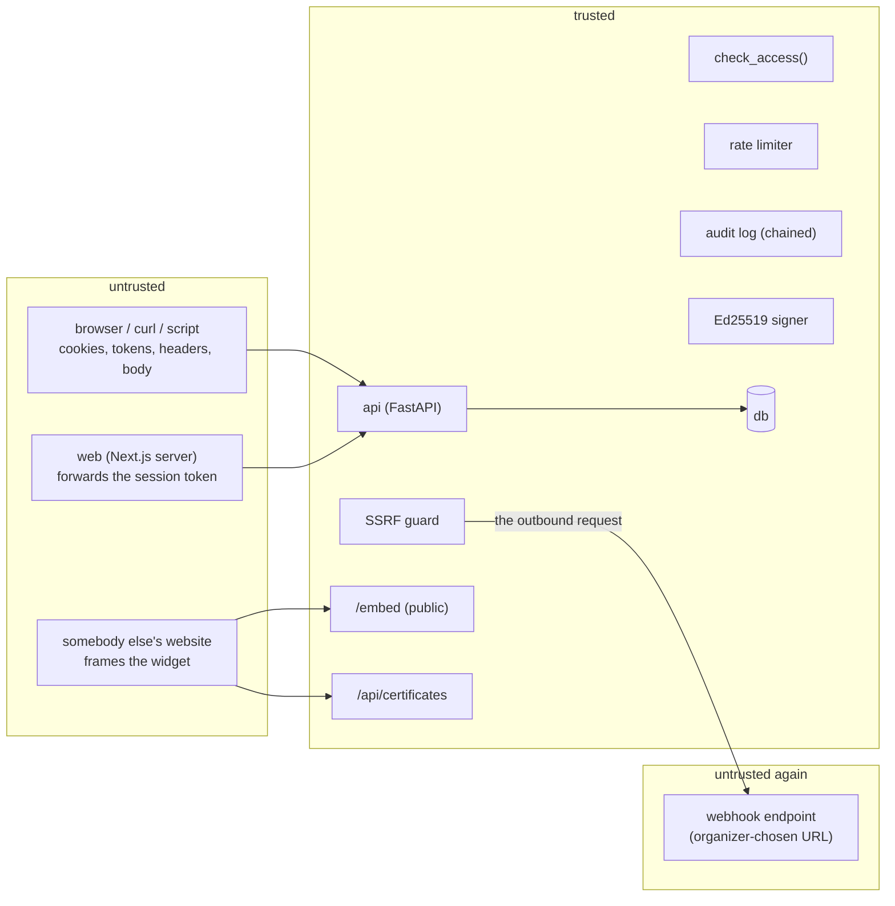

# Threat Model

> Scope: submission and vote abuse, the judging integrity that depends on it, and
> the outbound and public surfaces T4 adds. Covers what is built through Phase 5's
> self-audit pass (which closed §7's single-key signing gap and §10's
> audit-log-integrity gap, and added pairwise judging -- no new threat surface of
> its own beyond what §1's judging-integrity table already covers -- a pairwise
> comparison is graded the same "who may write it, when, about what" way a score
> is), Phase 6, and a later pass that found and closed §7's certificate-discovery
> gap.
>
> The brief asks for "the attacks you stopped, and the ones you did not", and says
> the honest list is worth more than the heroic one. So §10 is as long as §3, and
> the things that are *not* defended are named with what they would cost an
> attacker rather than waved at.

## The thing worth attacking

A hackathon platform has one asset: **the ranking**. Everything else — accounts,
submissions, comments — matters only because it moves the ranking or embarrasses
the organizer. So the threats are ordered by how directly they change who wins.

Two assumptions, both deliberately pessimistic:

1. **Everything the client sends is attacker-controlled**, including ids, cookies,
   tokens, and headers. Any header-based identity (`X-Forwarded-For`) is therefore
   not an identity.
2. **The attacker can read the source.** It is MIT on GitHub. Nothing here depends
   on an attacker not knowing how it works, and anywhere a defence would depend on
   that is a defence that is not claimed.

### Trust boundaries

T4 adds a **second** untrusted boundary, on the right, and it is the important new
idea in this document: until now everything dangerous was inbound. A webhook is the
API making an outbound request to an address an *organizer* chose, from inside the
Docker network — so the SSRF guard is a trust boundary in the opposite direction from
every other control here.

`web` is **not** a trust boundary. It holds the session cookie and forwards it as a
bearer token, and it hides buttons — but every rule it appears to enforce is
re-decided by `api`. The project's stated invariant is that removing every check
from the UI must not change what the API permits, and
`tests/test_judging_isolation.py` proves it by bypassing the UI entirely.

---

## 1. Judge collusion and score forgery

| Attack                                                   | Status                | What stops it                                                                                                                                                                                                                  |
| -------------------------------------------------------- | --------------------- | ------------------------------------------------------------------------------------------------------------------------------------------------------------------------------------------------------------------------------ |
| A judge reads a peer's ballot to match or counter it     | **Stopped**     | `check_access` ownership check on `judge_assignments`; 403. Asserted over HTTP, not just as a predicate.                                                                                                                   |
| A judge reads the running aggregate to see where to push | **Stopped**     | `READ_RESULTS` is staff-only for all of T3.                                                                                                                                                                                  |
| A track judge reaches another track's work               | **Stopped**     | `judges_track()`; NULL track is not a wildcard.                                                                                                                                                                              |
| An**organizer** enters scores as a judge           | **Stopped**     | `Action.SCORE` is the one place staff privilege stops. There is no "on behalf of" parameter in the API at all.                                                                                                               |
| A judge reviews their own team's project                 | **Stopped**     | Hard constraint in assignment; the algorithm reports a shortfall rather than breaking it.                                                                                                                                      |
| A judge scores after the window closes                   | **Stopped**     | `event.judging_open(now)` in the same predicate.                                                                                                                                                                             |
| Two judges agree offline to both mark one project 5      | **NOT stopped** | Out of reach of software. Normalization limits the damage — a judge who marks one project far above their own distribution has that ballot standardised against it — and the audit log makes the pattern visible afterwards. |
| A judge scores everything 3 to avoid the work            | **Mitigated**   | Their ballots are mapped to the global mean and move no project. They still consume a review slot; the progress dashboard shows the completion but not the laziness.                                                           |

The collusion row is the honest one. Detecting it needs inter-rater reliability
reporting — flagging a judge whose ballots diverge systematically from their
co-reviewers — which is **not built** and is the single highest-value addition to
this document's defences.

## 2. Deadline gaming

| Attack                                                    | Status                        | What stops it                                                                                                                                                                                  |
| --------------------------------------------------------- | ----------------------------- | ---------------------------------------------------------------------------------------------------------------------------------------------------------------------------------------------- |
| Editing a submission after the deadline                   | **Stopped**             | One comparison in`check_access`, on every write path. 409.                                                                                                                                   |
| Sending a crafted`submitted_at` to look early           | **Stopped**             | The client cannot set it; the server stamps it.                                                                                                                                                |
| A naive (timezone-less) timestamp being compared wrongly  | **Stopped**             | Every timestamp is`timestamptz`, and the clock is one function.                                                                                                                              |
| Unsubmitting after the deadline to dodge judging          | **Stopped**             | `UNSUBMIT` is a separate action behind the same deadline.                                                                                                                                    |
| An**organizer** editing an entry after the deadline | **Allowed, and logged** | Deliberate: somebody has to fix a broken repo link in a hurry, and the alternative is that it happens in`psql`. Phase 3 writes it to the audit log naming the actor, the project and the fields. |
| Clock skew between the app and the database               | **Not applicable**      | All comparisons use the app clock; nothing compares an app timestamp against a database`now()` for a deadline decision.                                                                      |

## 3. Vote abuse

This is where the brief is most sceptical, and it is right to be. **What a vote
count means here depends entirely on the access mode**, and the API says so in the
tally's own `caveat` field rather than letting a reader assume.

| Attack                         | `authenticated`               | `email_gated`                                                          | `open_link`                                  |
| ------------------------------ | ------------------------------- | ------------------------------------------------------------------------ | ---------------------------------------------- |
| Vote twice from one identity   | Stopped (partial unique index)  | Stopped per address                                                      | Stopped per token                              |
| Mint a second identity         | Needs a second account          | Needs a second address —**cheap**                                 | Clear cookies —**free**                 |
| Script thousands of ballots    | Rate limited                    | Rate limited                                                             | Rate limited                                   |
| Vote for your own project      | Stopped                         | Stopped when signed in                                                   | **Not stopped** (no identity to compare) |
| Take over somebody's ballot    | No                              | **Refused** — a claimed address is not handed to whoever knows it | N/A                                            |
| Watch the tally to time a push | Stopped (hidden)                | Stopped                                                                  | Stopped                                        |
| Stack influence on one project | Bounded by the quadratic budget | Bounded                                                                  | Bounded                                        |

Stopped in every mode:

- **Duplicate votes** — `uq_votes_one_per_project` on `(voter_id, submission_id)`.
  A unique index, so two simultaneous submits cannot both win; the brief is
  explicit that this should not be application logic that races with itself.
- **Budget overspend** — the whole ballot is validated as a unit and refused whole.
  Three individually modest quadratic choices can be collectively unaffordable, and
  a per-project check would let them through.
- **Ballot stuffing via the cost curve** — listing a project twice is refused; `n`
  votes always cost `n²`.
- **Position bias** — every voter gets their own permutation of the ballot, seeded
  per voter, stable across refreshes. Over many voters no project owns the top slot
  (asserted in `test_position_bias_is_spread_across_voters`).
- **Voting outside the window, or on a draft** — time and state checks in the same
  predicate as everything else.
- **Watching results move** — `results_public_at` is NULL on every new event, so
  the tally is staff-only until an organizer deliberately publishes. Defaulting to
  hidden is the version of "hidden during the voting window" that cannot be got
  wrong by forgetting a step.

**Sybil resistance, stated plainly: there is none in `open_link`, and very little
in `email_gated`.** No email is delivered, so an address is a claim rather than a
credential. An organizer choosing those modes is choosing a popularity signal, not
a count of people, and the tally labels itself as such. The only mode with real
duplicate resistance is `authenticated`, and even there it is "one account per
vote" with account creation rate-limited — not identity verification.

This is the same position the incumbents are in. The difference claimed here is
that it is written down, the mode is the organizer's explicit choice, and the
weakness is asserted by a test (`test_open_link_voting_is_weak_and_we_say_so`)
rather than discovered by a judge.

## 4. Submission scraping and data exposure

| Attack                                        | Status                                   | What stops it                                                                                                                                   |
| --------------------------------------------- | ---------------------------------------- | ----------------------------------------------------------------------------------------------------------------------------------------------- |
| Reading another team's unsubmitted draft      | **Stopped**                        | 404, not 403 — a 403 would confirm it exists.                                                                                                  |
| Enumerating drafts by id                      | **Stopped**                        | Same, and uuid v4 ids are not guessable.                                                                                                        |
| Reading an unpublished event                  | **Stopped**                        | 404 unless staff or its creator.                                                                                                                |
| Lifting a team invite token to join uninvited | **Stopped**                        | `READ_INVITE` is members-and-staff; the token is rotatable, so a leaked link dies without deleting the team.                                  |
| Harvesting the public gallery                 | **Not stopped, and not a threat**  | It is a public gallery. Project pages are meant to be readable and shareable.                                                                   |
| Harvesting participant emails                 | **Stopped**                        | `UserPublic` carries a display name and role — no address. The judges list carries emails and is staff-only.                                 |
| Reading who voted for what                    | **Stopped for everyone but staff** | There is no route that serves another voter's ballot. Organizers can read the tally and the audit log; the per-ballot export is organizer-only. |

One deliberate asymmetry worth naming: **a judge's ballot is confidential from
peers but visible to organizers, while a voter's ballot is visible to organizers
too.** A fully secret ballot would be better for voters and would make abuse
impossible to investigate. The current position — organizers can see it, and the
audit log records that the data exists — is a trade, not an oversight. A real
secret ballot would need the voter identity separated from the vote at write time,
which also makes "one vote per person" unenforceable without blind signatures.
Out of scope, and named here because the word "secret" should not be used loosely.

## 5. Platform attacks

| Attack                                        | Status                        | Notes                                                                                                                                                                                                                                                                                                                                                                                                                                                                                                                                                                                                                                                                                                                                                                                                                                            |
| --------------------------------------------- | ----------------------------- | ------------------------------------------------------------------------------------------------------------------------------------------------------------------------------------------------------------------------------------------------------------------------------------------------------------------------------------------------------------------------------------------------------------------------------------------------------------------------------------------------------------------------------------------------------------------------------------------------------------------------------------------------------------------------------------------------------------------------------------------------------------------------------------------------------------------------------------------------ |
| Session theft from a database dump            | **Stopped**             | The table stores an HMAC of the token, keyed with`SESSION_SECRET`. A dump yields no usable cookies.                                                                                                                                                                                                                                                                                                                                                                                                                                                                                                                                                                                                                                                                                                                                            |
| Session theft from JavaScript                 | **Stopped**             | `HttpOnly`; the frontend is server-rendered and never reads the token in the browser.                                                                                                                                                                                                                                                                                                                                                                                                                                                                                                                                                                                                                                                                                                                                                          |
| Password cracking from a dump                 | **Mitigated**           | Argon2id, per-row salt.                                                                                                                                                                                                                                                                                                                                                                                                                                                                                                                                                                                                                                                                                                                                                                                                                          |
| Forging a session                             | **Stopped**             | Sessions are opaque random tokens looked up server-side; there is no claim to tamper with.                                                                                                                                                                                                                                                                                                                                                                                                                                                                                                                                                                                                                                                                                                                                                       |
| Privilege escalation by editing your own role | **Stopped**             | Role assignment is admin-only;`PATCH /api/auth/me` cannot reach `role`.                                                                                                                                                                                                                                                                                                                                                                                                                                                                                                                                                                                                                                                                                                                                                                      |
| An organizer minting organizers               | **Stopped**             | Admin-only, deliberately: an organizer who can mint organizers is an admin with extra steps.                                                                                                                                                                                                                                                                                                                                                                                                                                                                                                                                                                                                                                                                                                                                                     |
| A manager-level admin minting an owner        | **Stopped**             | Account administration (create users, change roles or levels, deactivate) is owner-only, one predicate in `access.py`. A manager cannot promote itself. `tests/test_admin_levels.py`. |
| A read-only admin (auditor) changing anything | **Stopped**             | Twice, on purpose: `check_access` refuses every verb outside a read list, and `get_current_principal` refuses any non-GET request before a handler runs, so a route that forgot `check_access` is still closed. Only `/api/auth/*` (sign out, own password) is exempt. |
| Locking everyone out of account administration | **Stopped**            | The last active owner cannot demote themselves. |
| Learning an account's role from the sign-in page | **Stopped**          | The role-tab check runs only *after* the password is verified, and a refusal creates no session. A wrong password gets the same 401 whatever tab was chosen, so the tab cannot be used to probe roles. |
| Changing an archived event                    | **Stopped**             | A gate in `check_access` refuses every non-read verb on the event and everything it owns; checked as a full verb-by-resource matrix, not a hand-picked list. Only staff can unarchive, and both directions are audited. |
| A judge learning the organizer's expected calibration scores | **Stopped** | The judge-facing response type has no field that could carry one, and calibration scores live in their own tables and never reach `gather()`, so practising cannot move a real result. |
| SQL injection                                 | **Stopped**             | SQLAlchemy parameter binding everywhere, including the one raw statement (the rate-limiter upsert).                                                                                                                                                                                                                                                                                                                                                                                                                                                                                                                                                                                                                                                                                                                                              |
| Acting as a deactivated account               | **Stopped**             | A deactivated account is no account — first branch of`check_access`.                                                                                                                                                                                                                                                                                                                                                                                                                                                                                                                                                                                                                                                                                                                                                                          |
| CSRF on a state-changing form                 | **Mitigated, no token** | Two things, and a re-check of a claim this row used to make that was not quite true. `SameSite=lax` on the session cookie is the load-bearing one: a browser does not attach it to a cross-site `POST` at all, and that holds **whether the browser is talking to `web` or directly to `api`** -- `get_current_principal` (`app/deps.py`) accepts the cookie on the API's own mutating routes exactly as it does through `web`, not bearer-only as this document previously claimed, so "API-first" genuinely means a second front door and `SameSite` is what closes it, not a second, independent mechanism. Confirmed no mutating route anywhere is exposed over `GET`, which is the one method `SameSite=lax` does *not* block on a cross-site top-level navigation. Next.js 15's own server actions add a second layer in front of `web` specifically: they reject a request whose `Origin` does not match `Host` (measured: same-origin POST 303 with a cookie, foreign-origin POST 500 with none — note it rejects *loudly* as a 500 rather than a 403, and that a request carrying **no** Origin header is accepted, which a browser never does cross-site but `curl` can). A bearer token is a different case, not because "an attacker's page cannot read it" -- CSRF is about a browser *automatically* attaching an ambient credential, and nothing automatically attaches a bearer header the way a cookie is attached, so a script that adds one is doing so on purpose. What is missing is defence in depth -- a per-session token -- so a future change that loosened `SameSite` would reopen this quietly, on both fronts, at once. |
| Resource exhaustion / DoS                     | **Not defended**        | Rate limits protect vote and comment endpoints, not the whole API. Anything serious belongs in front of the app.                                                                                                                                                                                                                                                                                                                                                                                                                                                                                                                                                                                                                                                                                                                                 |
| XSS via a project description or comment      | **Mitigated**           | React escapes by default and nothing uses`dangerouslySetInnerHTML`. No Content-Security-Policy is set, which would be the defence in depth.                                                                                                                                                                                                                                                                                                                                                                                                                                                                                                                                                                                                                                                                                                    |

## 6. Webhooks — outbound requests we make on request

The most dangerous thing in T4, because it inverts the usual direction of attack. The
API sits inside the Docker network, one hop from Postgres; on a cloud host, one hop
from the instance metadata service. A form that accepts a URL and then fetches it is a
server-side request forgery primitive with a friendly label on it.

| Attack                                                                 | Status                             | What stops it                                                                                                                                                                          |
| ---------------------------------------------------------------------- | ---------------------------------- | -------------------------------------------------------------------------------------------------------------------------------------------------------------------------------------- |
| Point a hook at`http://localhost:8000` to make the API call itself   | **Stopped**                  | Loopback refused.                                                                                                                                                                      |
| Point it at`http://db:5432` to reach Postgres                        | **Stopped**                  | Single-label hostnames are refused without consulting DNS — see below.                                                                                                                |
| Point it at`169.254.169.254` for cloud credentials                   | **Stopped**                  | Link-local refused.                                                                                                                                                                    |
| Point it at a private range (`10/8`, `192.168/16`, `172.16/12`)  | **Stopped**                  | `_is_public()` rejects private, reserved, multicast and unspecified.                                                                                                                 |
| `file:///etc/passwd`, `gopher://`, no scheme                       | **Stopped**                  | http and https only.                                                                                                                                                                   |
| A name that resolves to several addresses, one of them loopback        | **Stopped**                  | **Every** address from `getaddrinfo` is checked, not the first.                                                                                                                |
| Register a public name, then re-point its DNS at`127.0.0.1`          | **Stopped**                  | The guard runs again at delivery, not only at registration.                                                                                                                            |
| Register a name DNS cannot resolve yet, that resolves internally later | **Stopped**                  | Single-label names are refused on shape. Dotted unresolvable names are allowed at registration and re-checked at delivery.                                                             |
| Use a hook as a DoS amplifier against a third party                    | **Partially**                | One request per event, 5s timeout, and five consecutive failures disable the hook. Nothing stops a determined organizer pointing hooks at a victim; they are trusted to run the event. |
| Replay a captured delivery at the receiver forever                     | **Receiver's call, enabled** | The timestamp is**inside** the signed material, so a receiver that rejects old timestamps has a replay window. We cannot enforce that for them.                                  |
| Forge a delivery to a receiver                                         | **Stopped**                  | HMAC-SHA256 over`timestamp.body` with a per-hook secret.                                                                                                                             |
| Read another event's hook or its secret                                | **Stopped**                  | Composite FK scoping plus organizer-only routes; the secret is returned once, on creation, and never listed again.                                                                     |

**The single-label rule is worth explaining**, because it was added after the first
version of this guard was wrong. Checking only whether a name *resolves* to a private
address leaves a gap: `db` does not resolve on the laptop where an organizer registers
the hook, but resolves to a container on the host where the server later calls it. The
guard passed at registration and the attack landed at delivery. A hostname with no dot
cannot be a public FQDN, so it is now refused on shape — a decision that does not
depend on DNS answering, or on answering the same way twice.

### The webhook secret is stored in plaintext

Stated plainly because it is the one place this schema stores a secret it could read
back. Every other secret here is a digest: passwords are Argon2id, session and ballot
tokens are HMACs. A webhook secret cannot be, because the HMAC has to be *computed*
from it on every delivery.

The mitigation is scope, not storage: it signs outbound payloads and authenticates
nothing inbound. Someone with the database already has every ballot and every score;
the incremental damage of also having this is that they could forge deliveries to an
organizer's Slack relay. Rotation is delete-and-re-register, which is one click.

## 7. Signed records — forgery, enumeration and trust

The requirement is "publicly verifiable", which means the verification endpoint is
open by design, and the load-bearing word is *publicly*: a verifier should not have
to trust our verdict, only the maths. Phase 5 replaced the original HMAC design with
Ed25519 for exactly this reason — see `app/signing.py` for the full rationale and
`ARCHITECTURE.md`'s "Signing: bytes, not objects, and asymmetric on purpose".

| Attack                                                                  | Status            | What stops it                                                                                                                                                                                                                                                                                                                  |
| ----------------------------------------------------------------------- | ----------------- | ------------------------------------------------------------------------------------------------------------------------------------------------------------------------------------------------------------------------------------------------------------------------------------------------------------------------------ |
| Mint a fake certificate                                                 | **Stopped** | Ed25519 signature over the canonical payload, signed with the active private key. Forging one requires that private key, not a guess at a shared secret.                                                                                                                                                                       |
| Alter a record's contents after issue                                   | **Stopped** | The signature is over the stored bytes;`test_a_tampered_record_does_not_verify` edits the row behind the API's back and the verdict flips.                                                                                                                                                                                   |
| Enumerate codes to harvest records                                      | **Stopped** | 12 characters from a 32-symbol alphabet ≈ 62 bits.                                                                                                                                                                                                                                                                            |
| Discover another team's code through the legitimate lookup, no guessing needed | **Stopped (found in a later pass)** | `GET /submissions/{id}/certificates` — the lookup a participant's own certificate wizard uses to find the record naming them — answered with no authentication at all: anyone who could search up a project in the public gallery could list every code issued for it, and a code is the one thing the row above's 62 bits were protecting. The fix is scoped to *discovery*: the route now requires the caller to be a team member or staff. `tests/test_certificate_access.py` writes the isolation test first — a stranger is 403, an anonymous caller is 401 — and confirms a downloaded code still verifies with no account afterward, so the actual publicly-verifiable guarantee this section opens with is untouched. |
| Make a revoked record still read as valid                               | **Stopped** | `valid` is `signature_valid AND NOT revoked`, and the public response carries the reason.                                                                                                                                                                                                                                  |
| Fool a verifier by controlling the page that displays the record        | **Stopped** | The endpoint returns the exact signed bytes, the signature, and the`key_id` that names which published public key to check it against — a third party can verify with none of that borrowed from our own verdict or our HTML.                                                                                               |
| Invalidate every record by rotating session keys                        | **Stopped** | Signing keys are entirely separate from`SESSION_SECRET` — different config, different lifecycle.                                                                                                                                                                                                                            |
| Invalidate every past record by rotating the signing key                | **Stopped** | Each record stores the`key_id` it was signed with. Rotating moves the old key's *public* half into `SIGNING_RETIRED_KEYS` and starts a new active key; `verify()` looks the signature up by `key_id` against the combined active+retired set, so old records keep verifying under the key that actually signed them. |
| Learn the private signing key from a record or from the public endpoint | **Stopped** | `GET /api/signing/public-keys` publishes public halves only; Ed25519 does not leak the private key from a signature, and the private key is never serialised into a response.                                                                                                                                                |
| Timing-attack the verification                                          | **Stopped** | Ed25519`verify()` in `cryptography` is constant-time by construction — there is no hand-rolled byte comparison to time.                                                                                                                                                                                                   |

**Residual risk, by design rather than oversight: a compromised *active* private key
forges every new record until it is rotated out.** No signature scheme removes that —
whoever holds the key that signs can sign. What asymmetric signing with rotation
changes is the blast radius and the recovery path: a compromise no longer invalidates
history (old records signed under other keys are unaffected) and recovery is "rotate
to a new key," not "every certificate ever issued is now unverifiable."

## 8. The embeddable widget

The feature *is* being framed by a stranger's website, so the usual framing defences
are deliberately absent. That makes the question "what can a hostile embedder do?"

| Attack                                              | Status                        | Notes                                                                                                                                                                                                                             |
| --------------------------------------------------- | ----------------------------- | --------------------------------------------------------------------------------------------------------------------------------------------------------------------------------------------------------------------------------- |
| Clickjack the widget to trigger an action           | **Not applicable**      | The frame is read-only: no forms, no buttons, no state change reachable from it.                                                                                                                                                  |
| XSS via a project name or tagline                   | **Stopped**             | Every interpolated value goes through`html.escape`, and the frame's CSP is `default-src 'none'; style-src 'unsafe-inline'` — no script can run in it even if escaping were wrong.                                            |
| Use the frame to ride a visitor's session           | **Stopped**             | The endpoint reads no cookie and makes no authorization decision; it serves exactly what an anonymous gallery request serves.                                                                                                     |
| Leak the embedding page's URL to us                 | **Stopped**             | `Referrer-Policy: no-referrer`.                                                                                                                                                                                                 |
| Get a draft or an unpublished event into the widget | **Stopped**             | Reuses`PUBLIC_SUBMISSION_CRITERIA`, the same tuple the gallery filters by. Asserted by a test, because an embed is the surface nobody re-checks after launch.                                                                   |
| Compromise the embedding site through us            | **Mitigated by design** | The widget is an**iframe**, not injected markup. The one-line `.js` snippet writes the tag and nothing else, so our code never executes in the host origin. This is the main reason not to build it the conventional way. |
| Scrape the gallery through the widget               | **Not a threat**        | It is a public gallery.                                                                                                                                                                                                           |

## 9. Bulk import and export

| Attack                                                       | Status                                               | What stops it                                                                                                                                                                                                                                                                                                                                              |
| ------------------------------------------------------------ | ---------------------------------------------------- | ---------------------------------------------------------------------------------------------------------------------------------------------------------------------------------------------------------------------------------------------------------------------------------------------------------------------------------------------------------- |
| Import a CSV naming another event's rows, to edit them       | **Stopped**                                    | Every row is scoped to the event in the URL; a foreign id is a per-row error, never a write. Asserted, including that the other event's export is byte-identical afterwards.                                                                                                                                                                               |
| Import as a participant                                      | **Stopped**                                    | Organizer-only, like export.                                                                                                                                                                                                                                                                                                                               |
| Re-assign a project to another team by spreadsheet           | **Stopped**                                    | The importer cannot write`team` or `status` — those are what the deadline and ownership rules exist to protect.                                                                                                                                                                                                                                       |
| Mark a draft submitted after the deadline via import         | **Stopped**                                    | Same:`status` is not importable.                                                                                                                                                                                                                                                                                                                         |
| Fabricate scores or votes by importing them                  | **Stopped**                                    | There is no importer for judging data or votes, deliberately. A ballot you can paste in is not a ballot.                                                                                                                                                                                                                                                   |
| **Formula injection into the organizer's spreadsheet** | **Stopped (found while writing this section)** | A participant controls their project name.`=cmd\|'/c calc'!A1` is a formula to Excel, and the file carrying it is one *we* generated and told the organizer to trust. Cells beginning `=`, `+`, `-`, `@`, tab or CR are prefixed with a text guard on export, and the guard is stripped on import so the byte-identical round trip still holds. |
| Exhaust memory with a huge upload                            | **Mitigated**                                  | 5 MB cap, rejected before parsing.                                                                                                                                                                                                                                                                                                                         |
| Zip-bomb or non-UTF-8 payload                                | **Stopped**                                    | No archive formats accepted; a decode failure is a 422.                                                                                                                                                                                                                                                                                                    |

Bulk import is also the most destructive organizer-only route in the product — it
writes many rows from a file — so it is audited with the counts, and the audit entry
is the only record of what a bad import changed. **There is no undo.** A snapshot
before import would be the obvious next thing.

## 10. What we did not stop

Collected in one place so nobody has to infer it from the tables above.

1. **Sybil voting in `open_link` and `email_gated`.** The central one. See §3.
2. **Judge collusion.** Needs inter-rater reliability reporting. Not built.
3. **No CSRF token.** The three mechanisms in §5 cover it today, but none of them
   is the defence a reviewer looks for, and all three are properties of
   configuration rather than of this code. Cheap to add; listed in §7.
4. **The portal sets no security headers, and nothing is served over TLS by
   default.** The API does set them (`nosniff`, `X-Frame-Options: DENY`,
   `Referrer-Policy`, `Permissions-Policy`, HSTS, and a locked-down CSP on JSON
   routes; `tests/test_security_headers.py`) -- but the pages a browser actually
   renders are served by the Next.js app, which sets none of those. The shipped
   compose is plain HTTP for local-first reasons (so the HSTS header is inert
   there: browsers only honour it over HTTPS), and `session_cookie_secure`
   defaults to false so that local HTTP works at all. A real deployment must set
   it and terminate TLS in front. (An earlier revision of this item said the app
   had no security headers at all; that overstated the gap on the API side.)
5. **Rate limiting is IP-based, and IP is spoofable at the edge and shared by
   everyone behind a NAT.** Phase 5 added a second, independent key alongside IP for
   every route that has an identity to key on — login also keys on the account,
   voting also keys on the voter, commenting also keys on the user — so a shared IP
   no longer shares a single budget, and a spoofed IP no longer resets an
   authenticated abuser's counter (`ratelimit.enforce_dual`, checked as two separate
   limits rather than one combined key, since a combined key is *weaker* than either
   alone). Limits are still generous: a limiter that blocks a real voter is worse than
   none, because the organizer switches it off. It stops a script, not a determined
   person with a proxy pool and a fresh account each time.
6. **Fixed-window rate limiting** permits a double burst across a window boundary.
   Known, and irrelevant at the scale this is defending.
7. ~~No audit log integrity.~~ **Fixed in Phase 5.** Every entry now stores
   `prev_hash`/`entry_hash` — a SHA-256 hash chain over a strictly-ordered `seq`
   (a Postgres `IDENTITY` column, not the UUID primary key, since ordering is the
   property a chain needs and a UUID gives none). `GET /api/audit/verify`
   (admin-only) walks the chain and reports the first broken link, if any. Writing
   the next link is serialized with a Postgres advisory lock, so two concurrent
   writes cannot both read the same chain head and silently fork the chain. This
   still does not stop someone with raw database access from rewriting history *and*
   recomputing every hash after their edit through `verify_chain()` alone — no
   check run *inside* the database it protects can promise that, since nothing
   there attests to any historical head independently of the database itself.
   `record()` narrows that specific gap slightly rather than closing it: every
   new entry's `seq` and hash are also written to the container's log output
   (`docker compose logs`, and in a real deployment whatever aggregator that
   ships to), which lives outside the database. A rewrite-and-recompute attack
   now has to also alter that external trail to stay invisible, which is a
   second, different problem for an attacker to solve, not a hard stop — a full
   answer would be an append-only external store the app writes to and cannot
   edit, which this is not. Short of that full attack, an edit that stops short
   of recomputing every later hash (or one that predates the attacker gaining
   access) is detectable rather than invisible, which append-only-through-the-
   API alone did not give.
8. **No email verification anywhere.** Registration, email-gated voting, password
   reset (which does not exist). Phase 6 added best-effort outbound mail
   (`app/email.py`: registration confirmation, a results-published
   notification) but that is one-way notification, not verification --
   nothing about it proves the recipient controls the address it was sent
   to, and `email_gated` voting's own address is still exactly the
   unverified claim this point has always described.
9. **Vote timing analysis.** `created_at` on votes plus the audit log would let an
   organizer infer who voted when, and correlate with IP. Not mitigated; arguably
   should be, if votes are meant to feel private.
10. **Comment content is not moderated proactively.** No spam classifier, no link
    limits. The defences are authentication, rate limiting, and an organizer with a
    hide button.
11. ~~One signing key, no rotation path.~~ **Fixed in Phase 5.** Signing is Ed25519
    now (§7), and rotation has an actual path: retire the old key's public half into
    `SIGNING_RETIRED_KEYS`, point `SIGNING_ACTIVE_KID`/`SIGNING_ACTIVE_PRIVATE_KEY_PEM`
    at the new one. Records signed before the rotation keep verifying, because each
    one stores the `key_id` it was signed with and `verify()` checks against
    whichever key that names. A compromised active private key still forges new
    records until it is rotated out — nothing removes that risk category entirely —
    but it can no longer forge under a retired `key_id`, and rotating no longer
    destroys history the way invalidating a single shared secret used to.
12. **Webhook secrets are stored in plaintext**, because an HMAC must be computed from
    them. §6.
13. **Webhooks can be aimed at a third party.** Rate-limited by timeout and the
    failure cutoff, not prevented. An organizer is trusted to run the event.
14. **No undo for a bulk import.** The audit entry records the counts, not the previous
    values. §9.
15. **`SIGNING_ACTIVE_PRIVATE_KEY_PEM` and `SESSION_SECRET` ship with development
    defaults** in `docker-compose.yml` / `app/config.py`. That is right for a
    one-command local install and wrong for every other deployment; README says so,
    and nothing enforces it. Unlike a rotated `SESSION_SECRET` (which just logs
    everyone out), rotating away from the dev signing key does not invalidate
    anything already issued — it only starts signing *new* certificates with a key
    only the real deployment holds. See "Key rotation" in `app/signing.py`.
16. **Admin levels are platform-wide, and there is no second factor.** A compromised
    *owner* account can still do everything an admin ever could. Levels shrink the
    blast radius of the *other* admin accounts (a manager cannot mint owners, an
    auditor cannot write), but an admin scoped to a single event does not exist, and
    nothing here adds MFA. An auditor can also still change its own password.
17. **Archival is a freeze, not a seal.** Any staff member can unarchive an event
    and then change it. That is audited (`event_unarchived`) and is meant to be
    possible, but it means an archived event is protected from *accident and
    ordinary use*, not from a staff member acting on purpose. The audit log's hash
    chain is what makes that visible afterwards.
18. **A certificate's QR code is only as trustworthy as `WEB_BASE_URL`.** The verify
    URL is worked out when a document is rendered, not signed into it, so the
    signature proves the *record* is genuine while the link on the page depends on
    deployment configuration. The default (`localhost`) fails safe -- it goes
    nowhere for anyone else -- but a misconfigured value would point readers at the
    wrong host. OPERATIONS.md covers setting it.
19. **Judge calibration measures distance from one organizer's opinion.** It cannot
    detect collusion, only a judge whose scale differs from the organizer's; with
    one or two practice projects it is noisy. It is a flag for a conversation, not
    evidence, and JUDGING.md §10 says the same.

## 11. If we had another day

In the order we would actually do them. Items 1, 4, and 7 were done in Phase 5's
self-audit pass, ahead of schedule — left here, struck through, so the list still
reads as the honest priority order it was written in.

1. ~~**Asymmetric record signing**~~ — **Done.** Ed25519, published key, real
   rotation. §7.
2. **Inter-rater reliability flags** — closes the largest judging-integrity gap and
   is mostly arithmetic over data already stored.
3. **CSRF tokens on the server actions** — not closing an open hole, but replacing
   three configuration-dependent mitigations with one explicit one.
4. ~~**Hash-chained audit entries**~~ — **Done.** `prev_hash`/`entry_hash` over a
   `seq` `IDENTITY` column, verified by `GET /api/audit/verify`. §7.
5. **A CSP header on the main app** — the embed frame has one; the portal does not.
6. **A pre-import snapshot**, so a bad bulk import is reversible. §9.
7. ~~**Per-account rate limiting alongside per-IP**~~ — **Done.**
   `ratelimit.enforce_dual` on login, voting, and commenting. §5.
